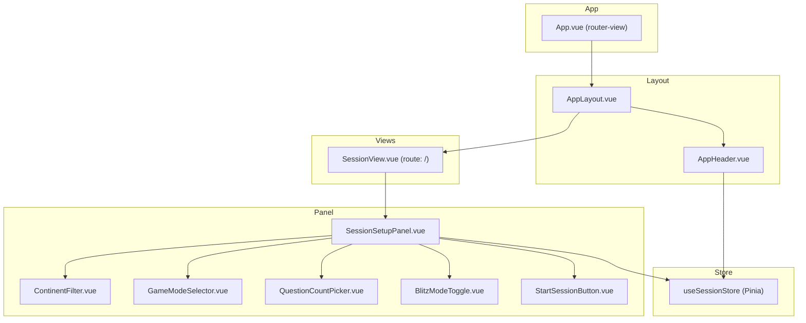

# Design Document: FlagIQ Session Setup

## Overview

The Session Setup screen is the entry point to a FlagIQ training session. It gives the user full control over four configuration axes — region filter, game mode, question count, and blitz timer — before launching the session. The design is a Vue 3 Composition API SFC tree, managed by a Pinia store, styled with PrimeVue v5 components and a Space Grotesk / dark-navy design language.

The overall page layout is split into two regions on desktop:

- **Left sidebar (~30% width):** the `SessionSetupPanel` component hosting all configuration controls.
- **Right area (~70% width):** a blank placeholder reserved for the future in-session game area.

On mobile the panel fills 100% width and scrolls independently below the sticky header.

No routing to a game page exists yet; a placeholder route `/session` is wired so the "Start Session" button has a navigation target ready for the next feature.

---

## Architecture



**Data flow:**
1. `SessionSetupPanel` reads and writes `SessionStore` directly via `storeToRefs` and the `updateConfig` action.
2. Child components receive current values as props and emit user interactions upward via events. `SessionSetupPanel` is the single source of truth coordinator between the UI and the store.
3. `AppHeader` reads `SessionStore.sessionActive` to conditionally show session controls (Requirement 7).
4. On "Start Session" click, `SessionSetupPanel` calls `SessionStore.updateConfig(currentConfig)` then navigates to `/session` via `useRouter`.

---

## Components and Interfaces

### `AppLayout.vue`

Top-level layout shell. Renders `AppHeader` and a `<router-view>` content area side by side on desktop, stacked on mobile.

```
┌─────────────────────────────────────────┐
│  AppHeader (sticky, full width)         │
├──────────────┬──────────────────────────┤
│ SessionSetup │  Future Game Area        │
│ Panel        │  (placeholder)           │
│ ~30% width   │  ~70% width              │
│ (sidebar)    │                          │
└──────────────┴──────────────────────────┘
```

CSS approach: CSS Grid with `grid-template-columns: minmax(0, 30fr) minmax(0, 70fr)` on desktop, `1fr` on mobile. The header uses `position: sticky; top: 0; z-index: 100`.

**Props:** none  
**Emits:** none

---

### `AppHeader.vue`

Persistent sticky header. Displays FlagIQ logo + name. Reads `SessionStore.sessionActive` to conditionally render session controls.

**Props:** none  
**Emits:** none  
**Store reads:** `sessionStore.sessionActive`

---

### `SessionView.vue`

Route component for `/`. Contains only `<SessionSetupPanel />`. Acts as thin wrapper to keep routing clean.

---

### `SessionSetupPanel.vue`

Orchestrates all configuration sub-components and owns the local reactive copy of `SessionConfig` that is committed to the store on submit.

**Internal state (via `ref` / `reactive`):**

| State field | Type | Default |
|---|---|---|
| `selectedContinents` | `Continent[]` | `[...ALL_CONTINENTS]` |
| `selectedMode` | `GameMode` | `'name-it'` |
| `selectedCount` | `QuestionCount` | `10` |
| `blitzEnabled` | `boolean` | `false` |

**Template structure:**

```
SessionSetupPanel
  ├── ContinentFilter     (@update:continents)
  ├── GameModeSelector    (@update:mode)
  ├── QuestionCountPicker (@update:count)
  ├── BlitzModeToggle     (@update:blitz)
  └── StartSessionButton  (@click:start)
```

---

### `ContinentFilter.vue`

Renders the "All Regions" chip and five continent chips.

**Props:**

```ts
interface ContinentFilterProps {
  modelValue: Continent[]   // currently selected continents
}
```

**Emits:**

```ts
'update:modelValue': (continents: Continent[]) => void
```

**Logic:**
- `isAllSelected` computed: `modelValue.length === 5`
- Selecting "All Regions" → emits all five continents
- Selecting individual chip → toggles that continent; if result is 5 or 0, normalises to all five (All Regions state)
- Each chip receives a continent-specific CSS class for colour

**PrimeVue components used:** none — custom `<button>` elements styled as chips for full colour control.

---

### `GameModeSelector.vue`

Renders four `ModeCard` items in a 2-column CSS grid.

**Props:**

```ts
interface GameModeSelectorProps {
  modelValue: GameMode
}
```

**Emits:** `'update:modelValue': (mode: GameMode) => void`

**Mode definitions (static data):**

| ID | Title | Subtitle | Icon |
|---|---|---|---|
| `type-it` | Type It | Type the country name from memory | ✏️ SVG |
| `choose-flag` | Choose Flag | Pick the correct flag from four options | 🚩 SVG |
| `find-on-map` | Find on Map | Tap the country on a world map | 🗺️ SVG |
| `name-it` | Name It | See the flag, name the country | 👁️ SVG |

Each `ModeCard` sub-component receives `{ id, title, subtitle, icon, selected }` props.

---

### `QuestionCountPicker.vue`

Renders four pill buttons: 10, 25, 50, "All".

**Props:**

```ts
interface QuestionCountPickerProps {
  modelValue: QuestionCount   // 10 | 25 | 50 | 'all'
  availableFlags: number      // total flags matching current filter
}
```

**Emits:** `'update:modelValue': (count: QuestionCount) => void`

**Logic:**
- Clicking an already-selected pill is a no-op.
- `effectiveCount` computed (exposed via `defineExpose` for parent use):
  - If `'all'`: `availableFlags`
  - Else: `Math.min(modelValue as number, availableFlags)`

---

### `BlitzModeToggle.vue`

Custom toggle with label and optional countdown badge.

**Props:**

```ts
interface BlitzModeToggleProps {
  modelValue: boolean
}
```

**Emits:** `'update:modelValue': (enabled: boolean) => void`

**Template:**
```
[⚡ Blitz Mode]  [60-second trial]   [toggle]
                [60s badge — visible when on]
```

**PrimeVue components used:** `ToggleSwitch` for the toggle element.

---

### `StartSessionButton.vue`

Full-width gradient button.

**Props:** none  
**Emits:** `'click:start': () => void`

**Styling:** CSS gradient background `linear-gradient(90deg, #2B5CE6, #6B4EE6)` with `box-shadow` drop. Always enabled (no disabled state).

---

## Data Models

### Type Definitions (`src/types/session.ts`)

```ts
export type Continent = 'europe' | 'asia' | 'americas' | 'africa' | 'oceania'

export type GameMode = 'type-it' | 'choose-flag' | 'find-on-map' | 'name-it'

export type QuestionCount = 10 | 25 | 50 | 'all'

export interface SessionConfig {
  continents: Continent[]    // min 1, max 5 — never empty
  mode: GameMode
  count: QuestionCount
  blitz: boolean
}

export const ALL_CONTINENTS: Continent[] = [
  'europe', 'asia', 'americas', 'africa', 'oceania',
]

export const VALID_COUNTS: QuestionCount[] = [10, 25, 50, 'all']

export const VALID_MODES: GameMode[] = [
  'type-it', 'choose-flag', 'find-on-map', 'name-it',
]
```

### Default Config

```ts
export const DEFAULT_SESSION_CONFIG: SessionConfig = {
  continents: [...ALL_CONTINENTS],
  mode: 'name-it',
  count: 10,
  blitz: false,
}
```

### Validation (`src/utils/sessionValidation.ts`)

```ts
export function isValidSessionConfig(config: unknown): config is SessionConfig {
  if (!config || typeof config !== 'object') return false
  const c = config as SessionConfig
  return (
    Array.isArray(c.continents) &&
    c.continents.length >= 1 &&
    c.continents.every(x => ALL_CONTINENTS.includes(x)) &&
    VALID_MODES.includes(c.mode) &&
    VALID_COUNTS.includes(c.count) &&
    typeof c.blitz === 'boolean'
  )
}
```

### Session Store (`src/stores/session.ts`)

```ts
export const useSessionStore = defineStore('session', () => {
  const config = ref<SessionConfig>({ ...DEFAULT_SESSION_CONFIG })
  const sessionActive = ref<boolean>(false)

  const selectedContinents = computed(() => config.value.continents)
  const selectedMode = computed(() => config.value.mode)
  const selectedCount = computed(() => config.value.count)
  const blitzEnabled = computed(() => config.value.blitz)

  function updateConfig(newConfig: SessionConfig): boolean {
    if (!isValidSessionConfig(newConfig)) return false
    config.value = { ...newConfig, continents: [...newConfig.continents] }
    return true
  }

  function startSession() {
    sessionActive.value = true
  }

  function endSession() {
    sessionActive.value = false
  }

  return {
    config,
    sessionActive,
    selectedContinents,
    selectedMode,
    selectedCount,
    blitzEnabled,
    updateConfig,
    startSession,
    endSession,
  }
})
```

### Flag Data Model

A minimal flag catalogue is stored as a static JSON array in `src/data/flags.ts`:

```ts
export interface Flag {
  id: string           // ISO 3166-1 alpha-2
  name: string         // country name
  continent: Continent
  emoji: string        // flag emoji (fallback)
  svgPath?: string     // path to SVG asset
}
```

The `availableFlags` count passed to `QuestionCountPicker` is derived from `SessionSetupPanel` by filtering the flags array by `selectedContinents`.

---

## Correctness Properties

*A property is a characteristic or behavior that should hold true across all valid executions of a system — essentially, a formal statement about what the system should do. Properties serve as the bridge between human-readable specifications and machine-verifiable correctness guarantees.*

### Property 1: Continent selection reflects exactly the selected chips

*For any* non-empty subset of the five continents selected via individual Region_Chips, the `Continent_Filter` should contain exactly those continents and the "All Regions" chip should be deselected.

**Validates: Requirements 1.3**

---

### Property 2: Deselecting all chips restores "All Regions" state

*For any* sequence of chip selections that results in zero individual chips selected, the component state should automatically revert to "All Regions" selected with all five continents in the `Continent_Filter`.

**Validates: Requirements 1.4**

---

### Property 3: Continent chips have distinct colors

*For any* rendering of the ContinentFilter component, each of the five Region_Chips must have a unique color identifier (CSS class) that is not shared with any other Region_Chip, and each chip's color must be consistent across all renders.

**Validates: Requirements 1.6**

---

### Property 4: Exactly one Mode_Card is always selected

*For any* sequence of valid game mode clicks (any combination and order of the four valid modes), exactly one Mode_Card must be in the selected state after every click, and that card must correspond to the most recently clicked mode.

**Validates: Requirements 2.2, 2.3**

---

### Property 5: Every Mode_Card renders required content within constraints

*For any* Mode_Card from the set of four game modes, the rendered card must contain an icon element, a non-empty title string, and a subtitle string whose length is at most 60 characters.

**Validates: Requirements 2.4**

---

### Property 6: Exactly one Question_Count pill is always selected (idempotence on re-click)

*For any* sequence of pill clicks (valid values: 10, 25, 50, "all"), exactly one pill must be selected after every click. Re-clicking the already-selected pill must leave the selection state unchanged.

**Validates: Requirements 3.2, 3.3**

---

### Property 7: "All" pill count is reactive to continent filter

*For any* continent filter selection while the "All" pill is active, the effective question count must equal the number of flags available for that continent filter. Changing the filter must update the count reactively without user interaction.

**Validates: Requirements 3.4**

---

### Property 8: Fixed question count is capped to available flags

*For any* (question_count, continent_filter) pair where the number of flags matching the filter is less than the selected count (10, 25, or 50), the effective question count must equal the number of available flags rather than the selected count.

**Validates: Requirements 3.5**

---

### Property 9: Start Session always commits the current config to the store before navigating

*For any* valid `SessionConfig` state (any combination of valid continents, mode, count, blitz), clicking "Start Session" must call `SessionStore.updateConfig` with the exact current config values, and this call must complete before any router navigation occurs.

**Validates: Requirements 5.2**

---

### Property 10: Start Session button is always enabled

*For any* valid `SessionConfig` state, the "Start Session" button must not be in a disabled state and must respond to click events.

**Validates: Requirements 5.4**

---

### Property 11: Header session controls visibility matches store session state

*For any* value of `SessionStore.sessionActive` (true or false), the Header must display session-specific controls if and only if `sessionActive` is `true`. This invariant must hold after any store state transition.

**Validates: Requirements 7.3, 7.4**

---

### Property 12: Store update is a total replace of config (round-trip)

*For any* valid `SessionConfig` object passed to `SessionStore.updateConfig`, reading the store's config immediately after the call must return a value deep-equal to the provided config.

**Validates: Requirements 8.1, 8.2**

---

### Property 13: Store rejects invalid configs and retains previous state

*For any* invalid `SessionConfig` input (empty continents array, unrecognised game mode string, invalid count value, non-boolean blitz field), calling `SessionStore.updateConfig` must leave the store state unchanged from its previous valid state and must not throw an unhandled exception.

**Validates: Requirements 8.4**

---

## Error Handling

### Validation errors in the store

`updateConfig` returns `false` on an invalid config and does not modify state. No exception propagates. The calling component can check the return value to show user feedback if needed (future enhancement).

### Empty continent filter

The `ContinentFilter` component enforces the invariant at the UI level: deselecting the last chip immediately triggers a transition back to "All Regions". The store's validation also rejects any config with an empty `continents` array as a second line of defence.

### Flag data loading

Flag data is a static import — no async fetch, no network failure path needed for this feature.

### Navigation guard

If `SessionStore.updateConfig` returns `false` (invalid config — should be unreachable in normal flow due to UI invariants), `StartSessionButton`'s handler logs a warning and does not navigate. Navigation is conditional on a successful store update.

### Viewport resize

Responsive layout is handled entirely in CSS via media queries. No JavaScript resize listener is needed, eliminating runtime errors from event listener lifecycle management.

---

## Testing Strategy

### Test framework

- **Unit / component tests:** Vitest + `@vue/test-utils` (already configured in the project)
- **Property-based tests:** `fast-check` (to be added as a dev dependency)
- **E2E:** Playwright (already configured)

### Unit tests (example-based)

Each component gets its own `*.spec.ts` under `src/__tests__/`:

| Test file | What it covers |
|---|---|
| `ContinentFilter.spec.ts` | Initial render (6 chips, All selected); clicking All Regions; selecting all 5 = All state |
| `GameModeSelector.spec.ts` | Renders exactly 4 cards; default is "Name It" |
| `QuestionCountPicker.spec.ts` | Renders 4 pills; default is 10 |
| `BlitzModeToggle.spec.ts` | Default off; toggle on shows 60s badge; toggle off hides badge |
| `StartSessionButton.spec.ts` | Button is rendered and not disabled; click emits event; gradient class present |
| `AppHeader.spec.ts` | Logo and name present; session controls hidden when sessionActive=false |
| `sessionStore.spec.ts` | Default state; update round-trip; invalid configs rejected |

### Property-based tests

Property tests live in `src/__tests__/properties/` and use `fast-check` with a minimum of 100 iterations per property.

Each test is tagged with a comment in the format:
`// Feature: flag-iq-session-setup, Property N: <property_text>`

| Property | Test file | Generator strategy |
|---|---|---|
| P1: Continent selection reflects selected chips | `continentFilter.property.spec.ts` | `fc.subarray(ALL_CONTINENTS, { minLength: 1 })` |
| P2: Deselecting all restores All Regions | `continentFilter.property.spec.ts` | Select random subset, deselect all one by one |
| P3: Continent chips have distinct colors | `continentFilter.property.spec.ts` | Render, extract classes, verify uniqueness |
| P4: Exactly one Mode_Card always selected | `gameModeSelector.property.spec.ts` | `fc.array(fc.constantFrom(...VALID_MODES), { minLength: 1 })` for click sequences |
| P5: Mode_Card subtitle ≤ 60 chars + required fields | `gameModeSelector.property.spec.ts` | Verify over all 4 static modes |
| P6: Exactly one pill selected + re-click idempotence | `questionCountPicker.property.spec.ts` | `fc.array(fc.constantFrom(...VALID_COUNTS), { minLength: 1 })` |
| P7: "All" pill reactive to filter | `questionCountPicker.property.spec.ts` | `fc.subarray(ALL_CONTINENTS, { minLength: 1 })` × filter change |
| P8: Fixed count capped to available | `questionCountPicker.property.spec.ts` | `fc.integer({ min: 1, max: 49 })` × `fc.constantFrom(10, 25, 50)` |
| P9: Start commits config before navigation | `sessionSetupPanel.property.spec.ts` | `fc.record({ continents, mode, count, blitz })` |
| P10: Start button always enabled | `startSessionButton.property.spec.ts` | `fc.record(...)` valid configs, verify not disabled |
| P11: Header controls match session state | `appHeader.property.spec.ts` | `fc.boolean()` for sessionActive |
| P12: Store update round-trip | `sessionStore.property.spec.ts` | `fc.record({ continents, mode, count, blitz })` valid configs |
| P13: Store rejects invalid + retains state | `sessionStore.property.spec.ts` | Generate invalid configs: empty array, bad mode string, bad count, non-boolean blitz |

### Integration / E2E tests

A Playwright spec (`e2e/session-setup.spec.ts`) covers:
- Full flow: configure session, click Start Session, verify navigation
- Responsive layout at 375px and 1280px viewport widths
- Sticky header remains visible on scroll

### Coverage targets

- All store logic: 100% branch coverage via unit + property tests
- All UI components: ≥ 90% line coverage
- All correctness properties: at least 100 fast-check iterations each
