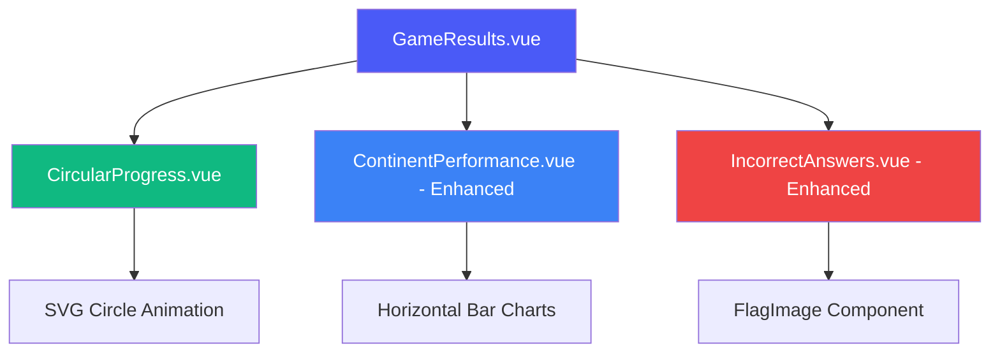
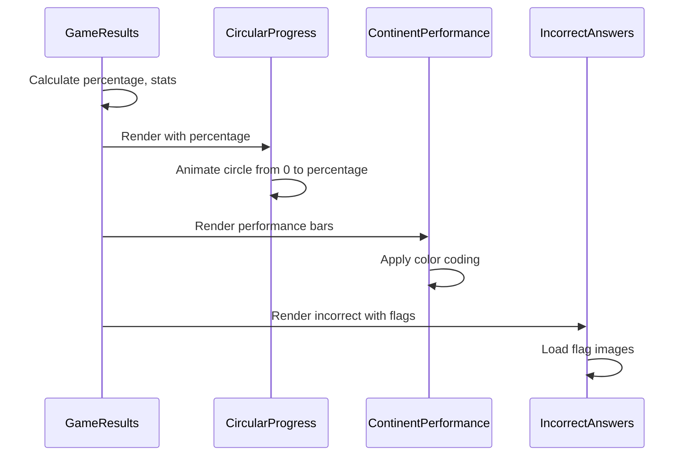

# Design Document: Game Results Screen Redesign

## Overview

This design describes a complete visual and structural redesign of the game results screen to match a polished, data-rich target design. The redesign transforms the current single-column mobile-first layout into a sophisticated two-column desktop experience featuring a prominent circular progress indicator, enhanced visual hierarchy, flag imagery in error displays, achievement/streak indicators, and refined styling throughout.

The key transformation is moving from a simple vertical stack to an asymmetric grid layout where the left side features a large summary card with circular progress visualization, while the right side displays detailed performance breakdowns in a compact, scannable format.

## Architecture

The redesigned results screen maintains the existing Vue 3 component architecture but introduces new sub-components and significant styling changes:



## Sequence Diagrams

### Component Rendering Flow



## Components and Interfaces

### Component 1: CircularProgress.vue (NEW)

**Purpose**: Display animated circular progress indicator showing percentage score

**Interface**:
```typescript
interface CircularProgressProps {
  percentage: number        // 0-100
  size?: number            // Circle diameter in pixels (default: 200)
  strokeWidth?: number     // Circle stroke width (default: 12)
  duration?: number        // Animation duration in ms (default: 1000)
  color?: string          // Progress color (default: '#4a5af7')
}
```

**Responsibilities**:
- Render SVG circular progress ring
- Animate progress from 0 to target percentage
- Display percentage text in center
- Responsive sizing based on viewport

**Implementation Details**:
- Uses SVG `<circle>` with `stroke-dasharray` and `stroke-dashoffset` for progress animation
- Calculates circumference: `2 * π * radius`
- Animates `stroke-dashoffset` from `circumference` to `circumference * (1 - percentage/100)`
- CSS transition for smooth animation
- Center text uses absolute positioning

### Component 2: GameResults.vue (ENHANCED)

**Purpose**: Main container orchestrating layout and data flow

**Interface**:
```typescript
interface GameResultsProps {
  score: number
  total: number
  elapsedMs: number
  answers: AnsweredQuestion[]
  locale?: 'en' | 'es'
}

interface GameResultsEmits {
  restart: []              // Play Again - restart same game config
  home: []                 // Home - navigate to home screen
}
```

**Layout Structure**:

**Desktop (≥768px)**:
```
┌─────────────────────────────────────────┐
│  LEFT COLUMN (40%)   │  RIGHT COLUMN    │
│  ┌─────────────────┐ │  ┌────────────┐  │
│  │ Circular        │ │  │ Performance│  │
│  │ Progress (big)  │ │  │ by Continent│  │
│  │                 │ │  └────────────┘  │
│  │ Session         │ │                  │
│  │ Complete! 🎉    │ │  ┌────────────┐  │
│  │                 │ │  │ Errors to  │  │
│  │ 7 Correct ✓     │ │  │ Review     │  │
│  │ 3 Incorrect ✗   │ │  │ (with flags)│  │
│  │                 │ │  └────────────┘  │
│  │                 │ │                  │
│  │ [Play Again →]  │ │                  │
│  │ [Back to Home]  │ │                  │
│  └─────────────────┘ │                  │
└─────────────────────────────────────────┘
```

**Mobile (<768px)**:
```
┌─────────────────────┐
│  Circular Progress  │
│  Session Complete!  │
│  7 ✓ / 3 ✗         │
└─────────────────────┘
┌─────────────────────┐
│  Performance by     │
│  Continent          │
└─────────────────────┘
┌─────────────────────┐
│  Errors to Review   │
│  (with flags)       │
└─────────────────────┘
┌─────────────────────┐
│  [Play Again →]     │
│  [Back to Home]     │
└─────────────────────┘
```

### Component 3: ContinentPerformance.vue (ENHANCED)

**Purpose**: Display performance breakdown by continent with visual bars

**Enhanced Features**:
- More prominent title
- Larger, more visible progress bars
- Color-coded by performance level:
  - Green (#10b981) for 100%
  - Blue (#4a5af7) for 78%+
  - Orange (#f59e0b) for 50-77%
  - Red (#ef4444) for <50%
- Percentage labels inline with bars
- Better spacing and typography

**Interface**:
```typescript
interface ContinentPerformanceProps {
  performance: ContinentStats[]
  locale?: 'en' | 'es'
  compact?: boolean        // NEW: Compact mode for right column
}

interface ContinentStats {
  continent: string
  correct: number
  total: number
  percentage: number
}
```

### Component 4: IncorrectAnswers.vue (ENHANCED)

**Purpose**: Display incorrect answers with flag images and clear formatting

**Enhanced Features**:
- Flag images displayed prominently (not just text)
- Uses existing FlagImage component
- Clear visual separation between items
- "You answered X" formatting
- Correct answer emphasized
- Card-based layout with hover effects

**Interface**:
```typescript
interface IncorrectAnswersProps {
  incorrect: IncorrectAnswer[]
  locale?: 'en' | 'es'
  showFlags?: boolean      // NEW: Toggle flag display (default: true)
}

interface IncorrectAnswer {
  correctFlag: FlagData
  chosenFlag: FlagData
  continent: string
}

interface FlagData {
  id: string
  name: string
  nameEs: string
  emoji: string
  code: string           // For flag image path
}
```

**Visual Layout per Item**:
```
┌────────────────────────────────────────┐
│ 🇫🇷 France                            │
│ You answered: Germany 🇩🇪              │
│ Continent: Europe                      │
└────────────────────────────────────────┘
```

## Data Models

### ResultsViewModel

```typescript
interface ResultsViewModel {
  // Score data
  score: number
  total: number
  percentage: number
  correctCount: number
  incorrectCount: number
  
  // Timing
  elapsedMs: number
  formattedTime: string
  
  // Performance breakdown
  continentPerformance: ContinentStats[]
  incorrectAnswers: IncorrectAnswerDisplay[]
  
  // UI state
  message: string
  emoji: string
}

interface ContinentStats {
  continent: string
  correct: number
  total: number
  percentage: number
  color: string          // NEW: Computed color based on percentage
}

interface IncorrectAnswerDisplay {
  correctFlag: FlagDisplayData
  chosenFlag: FlagDisplayData
  continent: string
  questionType: string
}

interface FlagDisplayData {
  name: string
  nameEs: string
  emoji: string
  code: string
  imagePath: string      // NEW: Computed flag image path
}

```

## Styling System

### Color Palette

```typescript
const colors = {
  // Primary brand
  primary: '#4a5af7',
  primaryHover: '#3b4ac6',
  
  // Performance colors
  perfect: '#10b981',      // Green for 100%
  high: '#4a5af7',         // Blue for 78%+
  medium: '#f59e0b',       // Orange for 50-77%
  low: '#ef4444',          // Red for <50%
  
  // Neutrals
  text: '#1a1f3c',
  textSecondary: '#6b7280',
  border: '#e8ebf0',
  background: '#ffffff',
  backgroundSubtle: '#f9fafb',
  
  // Success/Error indicators
  success: '#10b981',
  error: '#ef4444'
}
```

### Typography Scale

```typescript
const typography = {
  // Headings
  h1: '2rem',              // 32px - Main title
  h2: '1.5rem',            // 24px - Section titles
  h3: '1.25rem',           // 20px - Subsection titles
  
  // Body
  bodyLarge: '1.125rem',   // 18px - Emphasis text
  body: '1rem',            // 16px - Default
  bodySmall: '0.9375rem',  // 15px - Secondary
  
  // Display
  display: '3.5rem',       // 56px - Score number
  displaySmall: '2rem',    // 32px - Percentage in circle
  
  // Weights
  weightRegular: 400,
  weightMedium: 500,
  weightSemibold: 600,
  weightBold: 700,
  weightExtrabold: 800
}
```

### Spacing System

```typescript
const spacing = {
  xs: '0.25rem',    // 4px
  sm: '0.5rem',     // 8px
  md: '1rem',       // 16px
  lg: '1.5rem',     // 24px
  xl: '2rem',       // 32px
  xxl: '3rem',      // 48px
  
  // Component-specific
  cardPadding: '1.5rem',
  cardPaddingLarge: '2.5rem',
  cardGap: '1rem',
  cardGapDesktop: '1.5rem'
}
```

### Border Radius Scale

```typescript
const borderRadius = {
  sm: '0.5rem',     // 8px - Small elements
  md: '0.75rem',    // 12px - Buttons
  lg: '1rem',       // 16px - Cards
  xl: '1.5rem',     // 24px - Large cards
  full: '999px'     // Circular
}
```

### Shadow System

```typescript
const shadows = {
  sm: '0 2px 8px rgba(0, 0, 0, 0.04)',
  md: '0 4px 16px rgba(0, 0, 0, 0.06)',
  lg: '0 4px 32px rgba(0, 0, 0, 0.08)',
  xl: '0 8px 48px rgba(0, 0, 0, 0.12)'
}
```

## Layout Specifications

### Desktop Grid Layout (≥768px)

```css
.results__container {
  display: grid;
  grid-template-columns: 2fr 3fr;  /* Left: 40%, Right: 60% */
  gap: 1.5rem;
  max-width: 1200px;
  margin: 0 auto;
  padding: 2rem;
}

.results__summary-column {
  grid-column: 1;
  display: flex;
  flex-direction: column;
  gap: 1rem;
}

.results__details-column {
  grid-column: 2;
  display: flex;
  flex-direction: column;
  gap: 1.5rem;
}
```

### Mobile Stack Layout (<768px)

```css
.results__container {
  display: flex;
  flex-direction: column;
  gap: 1rem;
  padding: 1rem;
}
```

## Circular Progress Implementation

### SVG Structure

```typescript
interface CircleGeometry {
  radius: number          // Inner radius of circle
  circumference: number   // 2 * π * radius
  center: number         // SVG viewBox center
  strokeWidth: number    // Thickness of circle
}

function calculateCircleGeometry(size: number, strokeWidth: number): CircleGeometry {
  const radius = (size - strokeWidth) / 2
  const circumference = 2 * Math.PI * radius
  const center = size / 2
  
  return { radius, circumference, center, strokeWidth }
}

function calculateDashOffset(circumference: number, percentage: number): number {
  return circumference * (1 - percentage / 100)
}
```

### Animation Approach

1. **Initial State**: `stroke-dashoffset` = `circumference` (0% filled)
2. **Final State**: `stroke-dashoffset` = `circumference * (1 - percentage/100)` (percentage filled)
3. **Transition**: CSS transition over 1000ms with ease-out easing
4. **Trigger**: Vue's `onMounted` hook or `watch` on percentage prop

```css
.circular-progress__fill {
  stroke-dasharray: var(--circumference);
  stroke-dashoffset: var(--circumference);
  transition: stroke-dashoffset 1s cubic-bezier(0.4, 0, 0.2, 1);
  transform: rotate(-90deg);
  transform-origin: center;
}

.circular-progress__fill--animated {
  stroke-dashoffset: var(--dash-offset);
}
```

## Error Handling

### Error Scenario 1: Missing Flag Images

**Condition**: Flag image fails to load from `/public/flags/{code}.svg`
**Response**: FlagImage component falls back to emoji rendering
**Recovery**: Display emoji flag with subtle background to maintain visual consistency

### Error Scenario 2: No Incorrect Answers

**Condition**: User achieved 100% score (perfect game)
**Response**: Hide IncorrectAnswers section entirely
**Recovery**: Desktop layout adjusts to single column for performance data

### Error Scenario 3: No Continent Data

**Condition**: Game session contained no continent-specific questions
**Response**: Hide ContinentPerformance section
**Recovery**: Expand summary card to fill more space

## Testing Strategy

### Unit Testing Approach

**CircularProgress Component**:
- Test percentage prop validates (0-100 range)
- Test circle geometry calculations
- Test dash offset calculations for various percentages
- Test animation class application
- Test responsive sizing

**Enhanced IncorrectAnswers Component**:
- Test flag image rendering with FlagImage component
- Test fallback to emoji when flag fails
- Test formatting of answer text
- Test empty state handling

**Enhanced ContinentPerformance Component**:
- Test color coding based on percentage ranges
- Test bar width calculations
- Test compact mode rendering
- Test sorting of continents

### Integration Testing Approach

**Desktop Layout**:
- Test grid layout renders correctly at ≥768px
- Test left column spans correct rows
- Test right column stacks performance and errors
- Test buttons span full width at bottom

**Mobile Layout**:
- Test vertical stacking at <768px
- Test all sections render in correct order
- Test touch-friendly button sizing
- Test spacing and padding adjustments

**Data Flow**:
- Test results data correctly flows to all child components
- Test computed properties derive correct values
- Test event emissions (restart, home, reviewErrors)

**Accessibility**:
- Test all interactive elements have proper ARIA labels
- Test keyboard navigation through buttons
- Test screen reader announcements for results
- Test color contrast ratios meet WCAG AA

## Performance Considerations

**Circular Progress Animation**:
- Use CSS transitions instead of JavaScript animations for better performance
- Use `will-change: stroke-dashoffset` to hint browser for optimization
- Limit animation to single property (stroke-dashoffset)

**Flag Image Loading**:
- Leverage existing FlagImage component's lazy loading
- Use eager loading for flags in viewport
- Implement skeleton loading for flags below fold
- Cache flag images in browser using existing flagLoader service

**Layout Rendering**:
- Use CSS Grid for desktop layout (hardware accelerated)
- Avoid layout thrashing by batching DOM reads/writes
- Use `contain: layout` on card containers for isolation

**Bundle Size**:
- CircularProgress component adds minimal overhead (SVG + small CSS)
- No external dependencies required

## Security Considerations

**No new security concerns introduced**:
- All data remains client-side (no new API calls)
- Flag images loaded from trusted local `/public` directory
- No user-generated content displayed
- No XSS risk (all text properly escaped by Vue)

**Existing Security Maintained**:
- Continue using Vue's built-in XSS protection
- Sanitize any user data before display
- Validate percentage values to prevent visual glitches

## Dependencies

**Existing Dependencies** (no new dependencies required):
- Vue 3.5.38 - Core framework
- TypeScript 6.0.0 - Type safety
- Pinia 3.0.4 - State management
- Vitest 4.1.9 - Unit testing
- Vite 8.0.16 - Build tooling

**Internal Dependencies**:
- `FlagImage.vue` - Reuse existing flag rendering component
- `flagLoader` service - Reuse existing flag loading service
- `calculateContinentPerformance` util - Existing utility function
- `extractIncorrectAnswers` util - Existing utility function

**No External Libraries Needed**:
- SVG circular progress implemented with vanilla SVG + CSS
- All animations using CSS transitions
- Grid layout using native CSS Grid
- No charting library required

## Correctness Properties

*A property is a characteristic or behavior that should hold true across all valid executions of a system—essentially, a formal statement about what the system should do. Properties serve as the bridge between human-readable specifications and machine-verifiable correctness guarantees.*

### Property 1: Circular Progress Accuracy

For any valid score and total, the circular progress percentage SHALL equal `Math.round((score / total) * 100)`, and the visual circle fill SHALL accurately represent this percentage within the 0-100% range.

**Validates: Requirements 1.9, 10.1, 10.8, 10.9**

### Property 2: Layout Responsiveness

For any viewport width ≥768px, the layout SHALL render in two-column grid format with summary on left and details on right. For any viewport width <768px, the layout SHALL render in single-column stack format.

**Validates: Requirements 2.1, 2.2, 2.3, 2.5**

### Property 3: Color Coding Consistency

For any continent performance data, the color coding SHALL follow the defined thresholds: green for 100%, blue for ≥78%, orange for 50-77%, and red for <50%.

**Validates: Requirements 5.2, 5.3, 5.4, 5.5**

### Property 4: Flag Image Fallback

For any incorrect answer entry, if the flag image fails to load, the component SHALL display the emoji fallback without visual disruption or layout shift.

**Validates: Requirements 4.5, 9.1**

### Property 5: Component Visibility Rules

For any results state, the IncorrectAnswers component SHALL only render when incorrect answers exist, and the ContinentPerformance component SHALL only render when continent data exists.

**Validates: Requirements 4.8, 5.9**

### Property 6: Animation Completion

For any circular progress component, the stroke-dashoffset animation SHALL complete within the specified duration (default 1000ms) and reach the exact target percentage, with no visual artifacts or incomplete rendering.

**Validates: Requirements 7.1, 7.6, 7.7, 7.8**

### Property 7: Accessibility Compliance

For any interactive element, proper ARIA labels SHALL be present, keyboard navigation SHALL work correctly, and color contrast ratios SHALL meet WCAG AA standards (minimum 4.5:1 for normal text, 3:1 for large text).

**Validates: Requirements 8.1, 8.2, 8.4, 8.5**

### Property 8: Data Integrity

For any results display, the sum of correct and incorrect counts SHALL equal the total questions, and all displayed statistics SHALL be derived from the source data without mutation or loss.

**Validates: Requirements 10.2, 10.5, 10.7**
