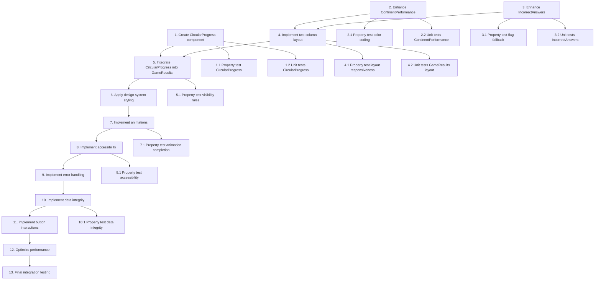

# Implementation Plan: Game Results Screen Redesign

## Overview

This implementation plan transforms the game results screen from a simple single-column layout to a sophisticated two-column desktop experience with circular progress visualization, enhanced visual hierarchy, and improved data presentation. The work is organized into 13 incremental steps building from core components to complete integration.

## Tasks

- [x] 1. Create CircularProgress component with SVG animation
  - Create `src/components/game/CircularProgress.vue` with TypeScript
  - Implement SVG circle with stroke-dasharray animation
  - Add percentage prop validation (0-100 range)
  - Implement circle geometry calculations (radius, circumference, dash offset)
  - Add center text display for percentage value
  - Implement CSS transition animation with cubic-bezier easing
  - Add optional props: size, strokeWidth, duration, color
  - Apply transform rotate(-90deg) to start circle at top
  - Make component responsive to viewport size changes
  - _Requirements: 1.1, 1.2, 1.3, 1.4, 1.5, 1.6, 1.7, 1.8, 1.9, 1.10_

- [ ]* 1.1 Write property test for CircularProgress calculations
  - **Property 1: Circular Progress Accuracy**
  - Test percentage calculation: Math.round((score / total) * 100)
  - Test circumference calculation: 2 * π * radius
  - Test dash offset calculation: circumference * (1 - percentage/100)
  - Validate geometry calculations for various sizes and stroke widths
  - **Validates: Requirements 1.9, 10.1, 10.8, 10.9**

- [ ]* 1.2 Write unit tests for CircularProgress component
  - Test percentage prop clamping to 0-100 range
  - Test default prop values
  - Test responsive sizing behavior
  - Test animation class application
  - _Requirements: 1.4, 1.10_

- [x] 2. Enhance ContinentPerformance component with color coding
  - Open existing `src/components/game/ContinentPerformance.vue`
  - Add color calculation function based on percentage thresholds
  - Implement color coding: green (100%), blue (≥78%), orange (50-77%), red (<50%)
  - Update horizontal bar styling to be larger and more prominent
  - Add inline percentage labels within bars
  - Enhance section title prominence
  - Add compact prop for right column rendering
  - Improve spacing and typography
  - Update CSS for better visual hierarchy
  - _Requirements: 5.1, 5.2, 5.3, 5.4, 5.5, 5.6, 5.7, 5.8, 5.9, 5.10_

- [ ]* 2.1 Write property test for color coding logic
  - **Property 3: Color Coding Consistency**
  - Test color assignment for 100% → green (#10b981)
  - Test color assignment for ≥78% → blue (#4a5af7)
  - Test color assignment for 50-77% → orange (#f59e0b)
  - Test color assignment for <50% → red (#ef4444)
  - **Validates: Requirements 5.2, 5.3, 5.4, 5.5**

- [ ]* 2.2 Write unit tests for enhanced ContinentPerformance
  - Test compact mode rendering
  - Test bar width calculations
  - Test continent sorting
  - _Requirements: 5.10_

- [x] 3. Enhance IncorrectAnswers component with flag images
  - Open existing `src/components/game/IncorrectAnswers.vue`
  - Import and integrate existing FlagImage component
  - Update layout to card-based design with visual separation
  - Display correct flag image prominently using FlagImage component
  - Format "You answered: [name]" text with chosen flag emoji
  - Display continent name for each incorrect answer
  - Add hover effects on card items
  - Implement showFlags prop (default: true)
  - Add proper spacing between card items
  - Update CSS for polished card appearance
  - _Requirements: 4.1, 4.2, 4.3, 4.4, 4.5, 4.6, 4.7, 4.8, 4.9, 4.10_

- [ ]* 3.1 Write property test for flag image fallback
  - **Property 4: Flag Image Fallback**
  - Test emoji fallback when image fails to load
  - Test no layout shift occurs during fallback
  - **Validates: Requirements 4.5, 9.1**

- [ ]* 3.2 Write unit tests for enhanced IncorrectAnswers
  - Test showFlags prop toggle behavior
  - Test flag image path construction
  - Test empty state handling (no incorrect answers)
  - _Requirements: 4.8, 4.9, 4.10_

- [x] 4. Implement responsive two-column layout in GameResults
  - Open existing `src/components/game/GameResults.vue`
  - Add CSS Grid layout for desktop (≥768px): 2fr 3fr columns
  - Implement single-column stack layout for mobile (<768px)
  - Create summary column (left) with 40% width on desktop
  - Create details column (right) with 60% width on desktop
  - Add 1.5rem gap between columns on desktop
  - Set max-width of 1200px for container
  - Add padding: 2rem on desktop, 1rem on mobile
  - Organize summary column: CircularProgress, title, stats, buttons
  - Organize details column: ContinentPerformance, IncorrectAnswers
  - Organize mobile stack: CircularProgress, ContinentPerformance, IncorrectAnswers, buttons
  - _Requirements: 2.1, 2.2, 2.3, 2.4, 2.5, 2.6, 2.7, 2.8, 2.9, 2.10_

- [ ]* 4.1 Write property test for layout responsiveness
  - **Property 2: Layout Responsiveness**
  - Test two-column grid renders at viewport ≥768px
  - Test summary column is 40% width (2fr) on desktop
  - Test details column is 60% width (3fr) on desktop
  - Test single-column stack renders at viewport <768px
  - **Validates: Requirements 2.1, 2.2, 2.3, 2.5**

- [ ]* 4.2 Write unit tests for GameResults layout
  - Test component ordering in desktop layout
  - Test component ordering in mobile layout
  - Test max-width and padding application
  - _Requirements: 2.6, 2.7, 2.8_

- [x] 5. Integrate CircularProgress into GameResults
  - Import CircularProgress component
  - Calculate score percentage: Math.round((score / total) * 100)
  - Pass percentage prop to CircularProgress
  - Position component in summary column layout
  - Wire up data flow from parent to child component
  - Test circular progress animation triggers on mount
  - _Requirements: 1.9, 10.1_

- [ ]* 5.1 Write property test for component visibility rules
  - **Property 5: Component Visibility Rules**
  - Test IncorrectAnswers renders only when incorrect answers exist
  - Test ContinentPerformance renders only when continent data exists
  - **Validates: Requirements 4.8, 5.9**

- [x] 6. Apply design system styling throughout
  - Create or update CSS variables for color palette (primary, perfect, high, medium, low, neutrals)
  - Apply shadow system (sm, md, lg, xl shadows)
  - Apply border radius scale (sm: 0.5rem, md: 0.75rem, lg: 1rem, xl: 1.5rem)
  - Apply spacing system (xs: 0.25rem through xxl: 3rem)
  - Apply typography scale (h1: 2rem, h2: 1.5rem, body: 1rem, display: 3.5rem)
  - Apply font weight scale (regular: 400, medium: 500, semibold: 600, bold: 700, extrabold: 800)
  - Update card padding (1.5rem mobile, 2.5rem desktop for large cards)
  - Apply background colors (#ffffff, #f9fafb for subtle)
  - Apply border colors (#e8ebf0)
  - Apply primary brand color (#4a5af7) to interactive elements
  - _Requirements: 6.1, 6.2, 6.3, 6.4, 6.5, 6.6, 6.7, 6.8, 6.9, 6.10_

- [x] 7. Implement animations and transitions
  - Add CSS transition to CircularProgress stroke-dashoffset
  - Set animation duration to 1000ms
  - Use cubic-bezier(0.4, 0, 0.2, 1) easing function
  - Add will-change: stroke-dashoffset hint for browser optimization
  - Verify animation starts at stroke-dashoffset = circumference
  - Verify animation ends at stroke-dashoffset = circumference * (1 - percentage/100)
  - Add smooth transitions for card hover effects
  - Add smooth transitions for button hover states
  - Test animation completion without visual artifacts
  - _Requirements: 7.1, 7.2, 7.3, 7.4, 7.5, 7.6, 7.7, 7.8, 7.9, 7.10_

- [ ]* 7.1 Write property test for animation completion
  - **Property 6: Animation Completion**
  - Test animation completes within 1000ms
  - Test final stroke-dashoffset equals target value
  - Test animation starts from circumference (0% filled)
  - Test no visual artifacts or incomplete rendering
  - **Validates: Requirements 7.1, 7.6, 7.7, 7.8**

- [x] 8. Implement accessibility features
  - Add ARIA labels to all interactive elements (buttons)
  - Ensure keyboard navigation works for all buttons (Enter, Space)
  - Add ARIA live region for results announcement to screen readers
  - Add aria-label to CircularProgress describing score percentage
  - Use semantic HTML structure with proper headings in IncorrectAnswers
  - Use semantic HTML structure with proper headings in ContinentPerformance
  - Add clear, descriptive labels to action buttons for screen readers
  - Ensure focus states are visible on all interactive elements
  - Verify color contrast ratios: 4.5:1 for normal text, 3:1 for large text
  - Test with keyboard-only navigation
  - _Requirements: 8.1, 8.2, 8.3, 8.4, 8.5, 8.6, 8.7, 8.8, 8.9, 8.10_

- [ ]* 8.1 Write property test for accessibility compliance
  - **Property 7: Accessibility Compliance**
  - Test ARIA labels present on all interactive elements
  - Test keyboard navigation functionality
  - Test color contrast ratios meet WCAG AA (4.5:1 normal, 3:1 large)
  - **Validates: Requirements 8.1, 8.2, 8.4, 8.5**

- [x] 9. Implement error handling and fallbacks
  - Verify FlagImage component handles failed image loads with emoji fallback
  - Ensure emoji fallback displays without layout shift
  - Hide IncorrectAnswers when user achieves 100% score
  - Hide ContinentPerformance when no continent data available
  - Adjust desktop layout when sections are hidden to maintain balance
  - Clamp CircularProgress percentage to 0-100 range
  - Show subtle loading state in FlagImage during image load
  - Display fallback values (0%, "N/A") when calculations result in NaN
  - Display error message when no game data available
  - _Requirements: 9.1, 9.2, 9.3, 9.4, 9.5, 9.6, 9.7, 9.8_

- [x] 10. Implement data integrity and calculations
  - Verify percentage calculation: Math.round((score / total) * 100)
  - Validate correct count + incorrect count = total questions
  - Implement continent percentage calculation: (correct / total) * 100 per continent
  - Derive color coding from calculated percentages
  - Extract incorrect answers without mutating source array
  - Format elapsed time from milliseconds to readable format
  - Pass immutable data to child components (no prop mutation)
  - Verify dash offset calculation: circumference * (1 - percentage/100)
  - Verify circumference calculation: 2 * π * radius
  - Construct flag paths as: /public/flags/${code}.svg with lowercase code
  - _Requirements: 10.1, 10.2, 10.3, 10.4, 10.5, 10.6, 10.7, 10.8, 10.9, 10.10_

- [ ]* 10.1 Write property test for data integrity
  - **Property 8: Data Integrity**
  - Test correct + incorrect count equals total questions
  - Test statistics derived from source without mutation
  - Test immutable data passed to child components
  - **Validates: Requirements 10.2, 10.5, 10.7**

- [ ] 11. Implement button interactions and events
  - Emit restart event when "Play Again" button clicked (restarts game with same config)
  - Emit home event when "Home" button clicked (navigates to home screen)
  - Style "Play Again" button as primary action
  - Make action buttons span full width on mobile
  - Add appropriate spacing between buttons
  - Add hover and active states for visual feedback
  - Enable keyboard accessibility with Enter and Space key activation
  - Add focus indicators meeting WCAG AA standards
  - _Requirements: 11.1, 11.2, 11.3, 11.4, 11.5, 11.6, 11.7, 11.8, 11.9, 11.10_

- [x] 12. Optimize performance
  - Verify CircularProgress uses CSS transitions (not JavaScript animation)
  - Verify GameResults uses CSS Grid for layout rendering
  - Apply contain: layout on card containers for isolation
  - Batch DOM reads and writes to avoid layout thrashing
  - Verify FlagImage lazy loads flags below the fold
  - Verify FlagImage eager loads flags in viewport
  - Ensure flag images cached via flagLoader service
  - Verify CircularProgress adds minimal overhead (check bundle size)
  - Confirm no new external dependencies required
  - _Requirements: 12.1, 12.2, 12.3, 12.4, 12.5, 12.6, 12.7, 12.8, 12.9_

- [ ] 13. Final integration and testing checkpoint
  - Run all unit tests and property tests
  - Test desktop layout at various viewport widths (768px, 1024px, 1440px)
  - Test mobile layout at various viewport widths (320px, 375px, 414px)
  - Test with real game data (various scores, continent distributions)
  - Test perfect score scenario (100%, no incorrect answers)
  - Test zero score scenario (0%, all incorrect)
  - Test with missing data (no continent data)
  - Verify animations are smooth and complete without artifacts
  - Verify accessibility with keyboard navigation and screen reader
  - Verify color contrast ratios with accessibility tools
  - Ensure all tests pass, ask the user if questions arise

## Task Dependency Graph

## Notes

- Tasks marked with `*` are optional and can be skipped for faster MVP
- Each task references specific requirements for traceability
- The implementation builds incrementally from individual components to full integration
- Property tests validate universal correctness properties from the design document
- Unit tests validate specific examples, edge cases, and error conditions
- The circular progress component is the visual centerpiece and implemented first
- Layout changes are applied after core components are ready
- Accessibility and performance optimization are implemented throughout, with final verification at the end
- Only two action buttons: "Play Again" (restart) and "Home" (navigate home)
- No achievement/streak banner component is needed
