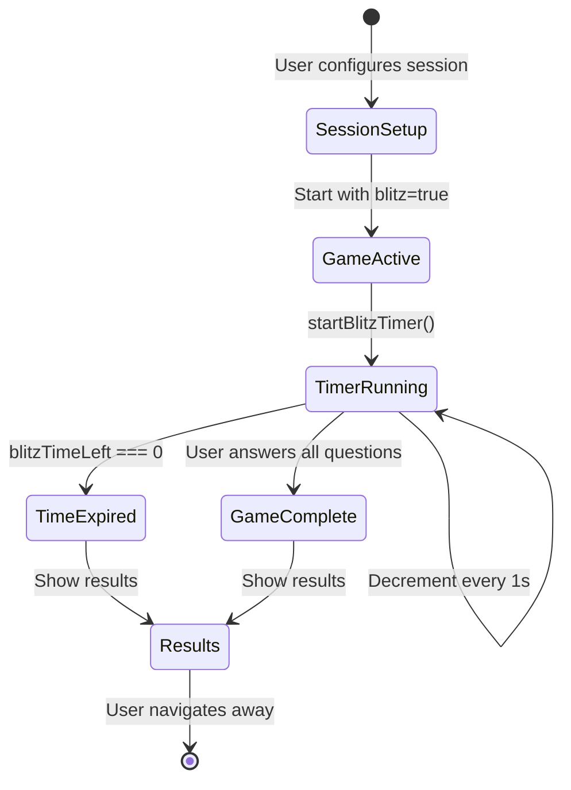
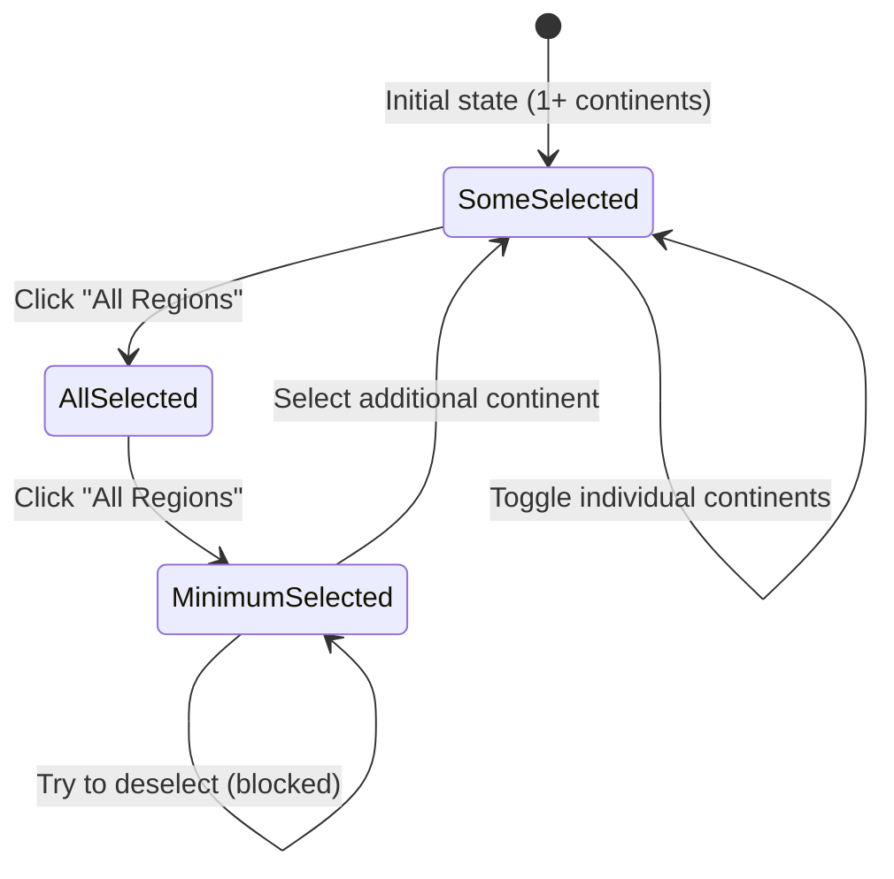
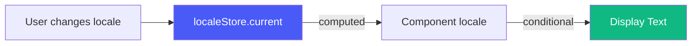

# Design Document: Game UX Improvements

## Overview

This document outlines the technical design for six user experience improvements to the FlagIQ application:

1. **Spanish Translation Completeness**: Complete the Spanish localization of all UI text
2. **Disable Similar Flags**: Hide and disable the Similar Flags feature
3. **Blitz Mode for All Game Modes**: Extend the 60-second Blitz mode to all 4 game modes
4. **All Regions Toggle Behavior**: Improve the "All Regions" button to toggle selection/deselection
5. **Lock Dark Mode**: Force light mode and remove theme toggle controls
6. **Fix Name It Mode Visual Bug**: Clear button states when advancing to the next question

### Background

The FlagIQ application is a Vue 3 + TypeScript flag learning game with four game modes (Name It, Choose Flag, Type It, Find On Map). The application already has partial Spanish translation support and a Blitz mode implementation for Find On Map. These improvements address usability issues and complete features that were partially implemented.

### Design Principles

- **Minimal invasiveness**: Modifications should be isolated to affected components
- **Backward compatibility**: Changes should not break existing functionality
- **Localization-first**: All user-facing text must support both English and Spanish
- **Graceful degradation**: Features should fail safely if data is unavailable


## Architecture

### Component Hierarchy

```
AppLayout
└── SessionSetupPanel (Requirement 1, 2, 4)
    ├── ContinentFilter (Requirement 4)
    ├── GameModeSelector (Requirement 1)
    ├── QuestionCountPicker (Requirement 1)
    ├── BlitzModeToggle (Requirement 1, 3)
    ├── SimilarityToggle (Requirement 2) [TO BE HIDDEN]
    └── StartSessionButton (Requirement 1)
└── Game Views
    ├── NameItQuestion (Requirement 1, 6)
    ├── ChooseFlagQuestion (Requirement 1, 3)
    ├── TypeItQuestion (Requirement 1, 3)
    ├── FindOnMapQuestion (Requirement 1, 3)
    └── GameResults (Requirement 1)
```

### State Management

**Stores affected:**
- `sessionStore` (session.ts): Handles session configuration including `useSimilarity` flag
- `gameStore` (game.ts): Manages game state and timer for Blitz mode
- `localeStore` (locale.ts): Manages current locale ('en' | 'es')

### Key Files to Modify

| Component | File Path | Requirements |
|-----------|-----------|--------------|
| SessionSetupPanel | `src/components/session/SessionSetupPanel.vue` | 1, 2 |
| ContinentFilter | `src/components/session/ContinentFilter.vue` | 1, 4 |
| GameModeSelector | `src/components/session/GameModeSelector.vue` | 1 |
| QuestionCountPicker | `src/components/session/QuestionCountPicker.vue` | 1 |
| BlitzModeToggle | `src/components/session/BlitzModeToggle.vue` | 1, 3 |
| StartSessionButton | `src/components/session/StartSessionButton.vue` | 1 |
| NameItQuestion | `src/components/game/NameItQuestion.vue` | 1, 6 |
| ChooseFlagQuestion | `src/components/game/ChooseFlagQuestion.vue` | 1, 3 |
| TypeItQuestion | `src/components/game/TypeItQuestion.vue` | 1, 3 |
| FindOnMapQuestion | `src/components/game/FindOnMapQuestion.vue` | 1, 3 |
| GameResults | `src/components/game/GameResults.vue` | 1 |
| App.vue | `src/App.vue` | 5 |


## Components and Interfaces

### 1. Spanish Translation System

#### Translation Approach

**Pattern**: Conditional rendering based on `locale` prop/computed value

All components receive or access the locale via:
```typescript
// From localeStore
const localeStore = useLocaleStore()
const locale = computed(() => localeStore.current)

// Or via prop
const props = defineProps<{
  locale?: 'en' | 'es'
}>()
```

**Translation Mapping**:
```typescript
// Inline conditional pattern (preferred for brevity)
const title = locale.value === 'es' ? 'Configuración de Sesión' : 'Session Setup'

// Object lookup pattern (for complex translations)
const translations = {
  en: { title: 'Session Setup', subtitle: '...' },
  es: { title: 'Configuración de Sesión', subtitle: '...' }
}
const t = translations[locale.value]
```

#### Components Requiring Translation

**SessionSetupPanel.vue**:
- Panel header title: "Session Setup" → "Configuración de Sesión"
- Panel header subtitle: "Set up your learning configuration below." → "Configura tu sesión de aprendizaje a continuación."
- Section headings:
  - "Continent Filter" → "Filtro de Continentes"
  - "Game Mode" → "Modo de Juego"
  - "Questions" → "Preguntas"

**ContinentFilter.vue**:
- No text changes needed (continent names remain in English per requirements, button text "All Regions" stays in English)

**BlitzModeToggle.vue**:
- Title: "⚡ Blitz Mode" → "⚡ Modo Relámpago"
- Subtitle: "60-second trial" → "Prueba de 60 segundos"
- Badge text: "60s" (no change)

**StartSessionButton.vue**:
- Button text: "Start Session" → "Iniciar Sesión"

**GameModeSelector.vue**, **QuestionCountPicker.vue**:
- Labels and descriptions need Spanish translations (specific text TBD based on component content)

**Game Mode Components (NameItQuestion, ChooseFlagQuestion, TypeItQuestion, FindOnMapQuestion)**:
- Mode labels need Spanish translations
- Example: "SEE THE FLAG · CHOOSE THE COUNTRY" → "VER LA BANDERA · ELIGE EL PAÍS"

**GameResults.vue**:
- Already has comprehensive Spanish translation support (verified in existing code)


### 2. Disable Similar Flags Feature

#### Implementation Strategy

**Goal**: Hide the UI toggle and force `useSimilarity` to `false` throughout the application.

**Changes Required**:

1. **SessionSetupPanel.vue**: Remove the SimilarityToggle component from the template
   ```vue
   <!-- DELETE THIS SECTION: -->
   <!-- <div class="panel-row">
     <section class="panel-card panel-card--full">
       <SimilarityToggle v-model="similarityEnabled" />
     </section>
   </div> -->
   ```

2. **SessionSetupPanel.vue**: Force `similarityEnabled` to `false` in `handleStart()`
   ```typescript
   const currentConfig: SessionConfig = {
     continents: selectedContinents.value,
     mode: selectedMode.value,
     count: selectedCount.value,
     blitz: blitzEnabled.value,
     useSimilarity: false,  // Always false
   }
   ```

3. **session.ts store**: Update `DEFAULT_SESSION_CONFIG` to have `useSimilarity: false`

4. **SessionSetupPanel.vue**: Remove the import statement for SimilarityToggle

**Rationale**: This approach cleanly removes the UI without breaking the underlying game logic. The `pickDistractors` function in `game.ts` already handles `useSimilarity: false` by falling back to random selection.

### 3. Blitz Mode for All Game Modes

#### Current State Analysis

**Existing Blitz Implementation** (Find On Map):
- Timer state managed in component-local reactive variables
- 60-second countdown using `setInterval`
- Auto-submit answer when timer expires

**Limitations**:
- Blitz logic is only implemented in FindOnMapQuestion.vue
- No centralized timer management
- Other game modes (Name It, Choose Flag, Type It) don't support Blitz


#### Proposed Architecture

**Option A: Component-Level Timer** (Current Pattern - Minimal Change)
- Each game mode component manages its own Blitz timer
- Duplicate timer logic across 4 components
- Pros: Isolated, no store changes
- Cons: Code duplication, harder to maintain

**Option B: Centralized Timer in GameStore** (Recommended)
- Add timer state to `gameStore` (game.ts)
- Components consume timer via computed properties
- Single source of truth for Blitz mode
- Pros: DRY, easier to test, consistent behavior
- Cons: Requires store refactoring

**Selected Approach**: **Option B** - Centralized timer in GameStore

#### GameStore Extensions

Add to `game.ts`:
```typescript
// New reactive state
const blitzMode = ref<boolean>(false)
const blitzTimeLeft = ref<number>(60)
const blitzTimerId = ref<number | null>(null)

// Computed
const isBlitzActive = computed(() => blitzMode.value && blitzTimeLeft.value > 0)

// Methods
function startBlitzTimer() {
  blitzMode.value = true
  blitzTimeLeft.value = 60
  
  blitzTimerId.value = window.setInterval(() => {
    if (blitzTimeLeft.value > 0) {
      blitzTimeLeft.value--
    } else {
      stopBlitzTimer()
      // Trigger game end
      finishedAt.value = Date.now()
      isActive.value = false
    }
  }, 1000)
}

function stopBlitzTimer() {
  if (blitzTimerId.value !== null) {
    clearInterval(blitzTimerId.value)
    blitzTimerId.value = null
  }
}

function reset() {
  // Existing reset logic...
  stopBlitzTimer()
  blitzMode.value = false
  blitzTimeLeft.value = 60
}
```

Update `startGame()`:
```typescript
function startGame(config: SessionConfig) {
  // Existing logic...
  
  if (config.blitz) {
    startBlitzTimer()
  }
}
```


#### Component Integration

Each game mode component needs:

1. **Import and consume timer state**:
```typescript
import { useGameStore } from '@/stores/game'

const gameStore = useGameStore()
const blitzTimeLeft = computed(() => gameStore.blitzTimeLeft)
const isBlitzActive = computed(() => gameStore.isBlitzActive)
```

2. **Display timer UI** (only when Blitz is active):
```vue
<div v-if="isBlitzActive" class="blitz-timer">
  <span class="blitz-timer__icon">⚡</span>
  <span class="blitz-timer__time">{{ blitzTimeLeft }}s</span>
</div>
```

3. **Watch for timer expiration**:
```typescript
watch(
  () => gameStore.isActive,
  (active) => {
    if (!active && gameStore.blitzMode) {
      // Game ended by Blitz timeout
      // Component should show results or emit navigation event
    }
  }
)
```

**Components to Update**:
- `NameItQuestion.vue` - Add timer UI and watch
- `ChooseFlagQuestion.vue` - Add timer UI and watch
- `TypeItQuestion.vue` - Add timer UI and watch
- `FindOnMapQuestion.vue` - **Refactor** existing timer logic to use store

### 4. All Regions Toggle Behavior

#### Current Behavior Analysis

**ContinentFilter.vue** - `selectAll()` function:
```typescript
function selectAll() {
  emit('update:modelValue', [...ALL_CONTINENTS])  // Always selects all
}
```

**Problem**: No toggle behavior, always selects all continents.

#### New Behavior Design

**Logic**:
1. If all continents selected → deselect all except one
2. If not all continents selected → select all
3. Prevent deselecting the last remaining continent via individual clicks

**Implementation**:

Update `selectAll()`:
```typescript
function selectAll() {
  if (props.modelValue.length === ALL_CONTINENTS.length) {
    // All selected → deselect to minimum (1 continent)
    const firstContinent = ALL_CONTINENTS[0]
    if (firstContinent) {
      emit('update:modelValue', [firstContinent])
    }
  } else {
    // Not all selected → select all
    emit('update:modelValue', [...ALL_CONTINENTS])
  }
}
```


Update `toggleContinent()` to enforce minimum selection:
```typescript
function toggleContinent(continent: Continent) {
  const isSelected = props.modelValue.includes(continent)

  // Prevent deselecting the last continent
  if (isSelected && props.modelValue.length === 1) {
    return  // Do nothing
  }

  const next = isSelected
    ? props.modelValue.filter((c) => c !== continent)
    : [...props.modelValue, continent]

  emit('update:modelValue', next)
}
```

**Visual Feedback**:
- Add disabled state styling when only one continent is selected
- Use `:disabled` attribute and CSS class to indicate non-interactive state

```vue
<button
  v-for="continent in ALL_CONTINENTS"
  :key="continent"
  class="chip"
  :class="{
    'chip--on': modelValue.includes(continent),
    'chip--off': !modelValue.includes(continent),
    'chip--locked': modelValue.includes(continent) && modelValue.length === 1
  }"
  :disabled="modelValue.includes(continent) && modelValue.length === 1"
  @click="toggleContinent(continent)"
>
  {{ continentConfig[continent].label }}
</button>
```

**Validation in SessionSetupPanel**:

Add validation before starting session:
```typescript
function handleStart() {
  if (selectedContinents.value.length === 0) {
    // Show error message (could use a toast/notification)
    console.error('[SessionSetupPanel] Cannot start with no continents selected')
    return
  }
  
  // Existing logic...
}
```

### 5. Lock Dark Mode

#### Current State

The application has CSS variables defined in `App.vue` but no dark mode implementation. The requirements specify forcing light mode only.

#### Implementation

**Changes to App.vue**:

1. **Remove dark mode CSS variables** (if they exist)
2. **Ensure light mode colors are always applied**
3. **Remove any theme toggle UI** (if present)

**Verify no `prefers-color-scheme` media queries**:
```css
/* DO NOT include: */
@media (prefers-color-scheme: dark) {
  /* ... dark mode vars ... */
}
```

**Document in CSS**:
```css
/* Design System CSS Variables - Light Mode Only
 * Dark mode is intentionally disabled until complete design is available
 */
:root {
  /* Existing light mode variables */
}
```

**Check AppHeader.vue** for theme toggle buttons and remove if present.


### 6. Fix Name It Mode Visual Selection Bug

#### Root Cause Analysis

**Problem**: Option buttons retain visual states (correct/wrong/disabled) from the previous question when advancing to the next question.

**Current Code** (NameItQuestion.vue):
```typescript
// State that persists across questions
const chosen = ref<string | null>(null)
const optionStates = ref<Record<string, OptionState>>({})

// Watch exists but may not be resetting properly
watch(
  () => props.question,
  () => {
    chosen.value = null
    optionStates.value = {}
  },
)
```

**Issue**: The watcher should be resetting state, but there might be timing issues or the watcher isn't triggering correctly.

#### Solution Design

**Approach 1: Strengthen the Watcher** (Recommended)
```typescript
watch(
  () => props.question,
  () => {
    // Force reset to ensure clean state
    chosen.value = null
    optionStates.value = {}
  },
  { immediate: false, deep: false }  // Explicit options
)
```

**Approach 2: Add Key Attribute to Force Re-render**
```vue
<div 
  class="options" 
  role="list"
  :key="question.correct.id"  <!-- Force re-render on question change -->
>
```

**Approach 3: Use onBeforeUpdate Hook**
```typescript
import { onBeforeUpdate } from 'vue'

onBeforeUpdate(() => {
  // Reset states before Vue updates the DOM
  chosen.value = null
  optionStates.value = {}
})
```

**Selected Approach**: Combination of **Approach 1** (strengthen watcher) and verify CSS classes are properly reactive.

#### Verification Strategy

Ensure the class bindings are purely derived from reactive state:
```vue
<button
  class="option-btn"
  :class="{
    'option-btn--correct': optionStates[opt.id] === 'correct',
    'option-btn--wrong': optionStates[opt.id] === 'wrong',
    'option-btn--disabled': chosen !== null,
  }"
  :disabled="chosen !== null"
>
```

The issue may also be related to **Vue's DOM recycling**. Using `:key` on the options container forces Vue to recreate the DOM elements rather than reusing them.


## Data Models

### SessionConfig Interface

**Existing** (in `types/session.ts`):
```typescript
export interface SessionConfig {
  continents: Continent[]
  mode: GameMode | null
  count: QuestionCount
  blitz: boolean
  useSimilarity?: boolean
}
```

**No changes required** - the interface already supports all needed fields.

### GameStore State Extensions

**New fields to add to `game.ts`**:
```typescript
// Blitz mode timer state
const blitzMode = ref<boolean>(false)
const blitzTimeLeft = ref<number>(60)
const blitzTimerId = ref<number | null>(null)
```

**Return from store**:
```typescript
return {
  // Existing exports...
  blitzMode,
  blitzTimeLeft,
  isBlitzActive: computed(() => blitzMode.value && blitzTimeLeft.value > 0),
  startBlitzTimer,
  stopBlitzTimer,
}
```

### Translation Data Structure

**No separate translation files needed**. Use inline conditional rendering based on locale:

```typescript
// Pattern used throughout components
const locale = computed(() => useLocaleStore().current)
const text = computed(() => 
  locale.value === 'es' ? 'Texto en español' : 'English text'
)
```


## Error Handling

### Translation Fallbacks

**Missing locale prop**:
```typescript
const locale = props.locale ?? useLocaleStore().current ?? 'en'
```

Default to English if locale is unavailable.

### Blitz Timer Edge Cases

**Timer cleanup on unmount**:
```typescript
import { onUnmounted } from 'vue'

onUnmounted(() => {
  if (blitzTimerId.value !== null) {
    clearInterval(blitzTimerId.value)
  }
})
```

**Multiple start calls**:
```typescript
function startBlitzTimer() {
  // Stop existing timer before starting new one
  stopBlitzTimer()
  
  blitzMode.value = true
  blitzTimeLeft.value = 60
  // ... rest of logic
}
```

**Timer reaches zero**:
```typescript
// In setInterval callback
if (blitzTimeLeft.value > 0) {
  blitzTimeLeft.value--
} else {
  stopBlitzTimer()
  finishedAt.value = Date.now()
  isActive.value = false
  // Game will transition to results automatically via route guard or watcher
}
```

### Continent Selection Validation

**Empty continent array**:
```typescript
function handleStart() {
  if (selectedContinents.value.length === 0) {
    // Log error and prevent navigation
    console.error('[SessionSetupPanel] Cannot start with no continents selected')
    // TODO: Show user-facing error message (toast/banner)
    return
  }
  // ... proceed with start
}
```

**Invalid continent data**:
- The `isValidSessionConfig` utility in `sessionValidation.ts` already validates continents
- Rely on existing validation in `sessionStore.updateConfig()`


### State Reset Issues

**Name It Mode visual bug**:
- Primary defense: Watcher resets state on question change
- Secondary defense: Add `:key` attribute to force DOM re-creation
- Tertiary defense: Verify CSS classes are purely reactive

**Blitz timer memory leak**:
- Clear interval on component unmount
- Clear interval before starting new timer
- Clear interval on game reset

## Testing Strategy

### Unit Tests

This feature involves UI changes, translation strings, state management logic, and visual bug fixes. Testing will focus on:

1. **Translation Coverage Tests**
   - Verify all components render Spanish text when `locale === 'es'`
   - Verify all components render English text when `locale === 'en'`
   - Test fallback behavior when locale is undefined

2. **Similar Flags Disable Tests**
   - Verify SimilarityToggle component is not rendered
   - Verify `useSimilarity` is always `false` in session config
   - Verify game uses random distractor selection (not similarity-based)

3. **Blitz Mode Tests**
   - Test timer starts when `config.blitz === true`
   - Test timer decrements every second
   - Test game ends when timer reaches 0
   - Test timer cleanup on unmount
   - Test timer state in all 4 game modes

4. **All Regions Toggle Tests**
   - Test toggle selects all when not all selected
   - Test toggle deselects to minimum (1) when all selected
   - Test cannot deselect last remaining continent
   - Test validation prevents starting with 0 continents

5. **Dark Mode Lock Tests**
   - Verify no dark mode CSS variables are active
   - Verify no theme toggle UI exists
   - Verify light mode colors are always applied

6. **Name It Visual Bug Tests**
   - Test state resets when question changes
   - Test no visual artifacts remain from previous question
   - Test option buttons return to idle state


### Integration Tests

1. **End-to-End Spanish Translation**
   - Navigate through full flow in Spanish locale
   - Verify all screens show Spanish text
   - Take snapshots for visual regression

2. **Blitz Mode Full Flow**
   - Start session with Blitz enabled
   - Verify timer is visible in each game mode
   - Let timer expire and verify game ends
   - Verify results show correctly

3. **Continent Selection Edge Cases**
   - Select all, deselect to 1, try to start
   - Try to deselect the last continent
   - Use All Regions toggle in various states

### Manual Testing Checklist

- [ ] All Spanish translations are grammatically correct and contextually appropriate
- [ ] SimilarityToggle is not visible in SessionSetupPanel
- [ ] Blitz timer displays and counts down in all 4 game modes
- [ ] Blitz timer expiration ends game and shows results
- [ ] All Regions button toggles between all/minimum selection
- [ ] Cannot deselect last continent individually
- [ ] Dark mode does not activate regardless of OS preference
- [ ] Name It mode buttons don't show previous question's state
- [ ] Layout remains responsive on mobile and desktop

### Performance Considerations

**Timer Performance**:
- Use `setInterval` with 1000ms instead of `requestAnimationFrame` for lower CPU usage
- Clear intervals properly to prevent memory leaks

**Re-render Optimization**:
- Use `computed` for derived values to minimize reactivity overhead
- Add `:key` attributes judiciously (only where needed to force re-renders)

**Bundle Size**:
- No additional dependencies required
- Translation strings add minimal size (~1-2KB)


## Implementation Notes

### Translation String Reference

**SessionSetupPanel.vue**:
```typescript
const translations = {
  en: {
    title: 'Session Setup',
    subtitle: 'Set up your learning configuration below.',
    continentFilter: 'Continent Filter',
    gameMode: 'Game Mode',
    questions: 'Questions'
  },
  es: {
    title: 'Configuración de Sesión',
    subtitle: 'Configura tu sesión de aprendizaje a continuación.',
    continentFilter: 'Filtro de Continentes',
    gameMode: 'Modo de Juego',
    questions: 'Preguntas'
  }
}
```

**BlitzModeToggle.vue**:
```typescript
const translations = {
  en: {
    title: '⚡ Blitz Mode',
    subtitle: '60-second trial'
  },
  es: {
    title: '⚡ Modo Relámpago',
    subtitle: 'Prueba de 60 segundos'
  }
}
```

**StartSessionButton.vue**:
```typescript
const buttonText = locale.value === 'es' ? 'Iniciar Sesión' : 'Start Session'
```

### Blitz Timer CSS

Consistent timer styling across all game mode components:

```css
.blitz-timer {
  position: fixed;
  top: 1rem;
  right: 1rem;
  display: flex;
  align-items: center;
  gap: 0.5rem;
  padding: 0.75rem 1.25rem;
  background: rgba(255, 255, 255, 0.95);
  border: 2px solid #f59e0b;
  border-radius: 9999px;
  box-shadow: 0 4px 12px rgba(0, 0, 0, 0.1);
  z-index: 100;
}

.blitz-timer__icon {
  font-size: 1.25rem;
}

.blitz-timer__time {
  font-size: 1.125rem;
  font-weight: 700;
  color: #92400e;
  font-variant-numeric: tabular-nums;
}

/* Warning state when time is low */
.blitz-timer--warning {
  border-color: #ef4444;
  animation: pulse 1s infinite;
}

@keyframes pulse {
  0%, 100% { opacity: 1; }
  50% { opacity: 0.8; }
}
```


### ContinentFilter Disabled State CSS

```css
.chip--locked {
  opacity: 0.7;
  cursor: not-allowed;
}

.chip--locked:hover {
  /* Prevent hover effects on locked chips */
  filter: none !important;
  transform: none !important;
}
```

### Implementation Order

Recommended implementation sequence to minimize merge conflicts:

1. **Requirement 5** (Lock Dark Mode) - Low risk, no dependencies
2. **Requirement 2** (Disable Similar Flags) - Low risk, isolated change
3. **Requirement 4** (All Regions Toggle) - Medium risk, affects session setup
4. **Requirement 6** (Fix Name It Bug) - Low risk, single component
5. **Requirement 1** (Spanish Translation) - Medium risk, touches many files
6. **Requirement 3** (Blitz Mode) - High risk, requires store refactoring and multi-component changes

### Migration Notes

**localStorage compatibility**:
- Existing saved sessions with `useSimilarity: true` will be overridden to `false`
- No migration script needed, handled automatically on session start

**Blitz mode backward compatibility**:
- FindOnMapQuestion.vue currently has its own timer implementation
- Refactor to use centralized store timer
- Remove component-local timer state and logic

### Accessibility Considerations

**Timer announcements**:
```vue
<div 
  v-if="isBlitzActive" 
  class="blitz-timer"
  role="timer"
  :aria-live="blitzTimeLeft <= 10 ? 'assertive' : 'polite'"
  :aria-label="locale === 'es' 
    ? `Tiempo restante: ${blitzTimeLeft} segundos` 
    : `Time remaining: ${blitzTimeLeft} seconds`"
>
```

**Continent selection**:
```vue
<button
  :aria-label="locale === 'es'
    ? `${continentConfig[continent].label}, ${modelValue.includes(continent) ? 'seleccionado' : 'no seleccionado'}`
    : `${continentConfig[continent].label}, ${modelValue.includes(continent) ? 'selected' : 'not selected'}`"
  :aria-pressed="modelValue.includes(continent)"
  :aria-disabled="modelValue.includes(continent) && modelValue.length === 1"
>
```


## Diagrams

### Blitz Mode State Flow



### Continent Selection State Machine



### Component Update Flow for Translations




## Risk Assessment

### High Risk

**Blitz Mode Timer Implementation**:
- **Risk**: Timer memory leaks if not cleaned up properly
- **Mitigation**: Use `onUnmounted` hooks, test cleanup thoroughly
- **Risk**: Race conditions between timer and user completing questions
- **Mitigation**: Use single source of truth in store, atomic state updates

### Medium Risk

**Translation Completeness**:
- **Risk**: Missing translations cause English fallback in unexpected places
- **Mitigation**: Systematic review of all components, manual testing in Spanish locale

**ContinentFilter Refactor**:
- **Risk**: Edge cases in selection logic (e.g., what if ALL_CONTINENTS is empty?)
- **Mitigation**: Unit tests for all toggle scenarios, validation at multiple layers

### Low Risk

**Disable Similar Flags**:
- **Risk**: Minimal - just hiding UI and forcing flag to false
- **Mitigation**: Simple change, existing game logic handles false value

**Fix Name It Bug**:
- **Risk**: Watcher might not fire in certain edge cases
- **Mitigation**: Use multiple defenses (watcher + key attribute)

**Lock Dark Mode**:
- **Risk**: Very low - just removing unimplemented feature
- **Mitigation**: Verify no dark mode CSS remains

## Future Considerations

### Extensibility

**Translation System**:
- Current inline approach works for 2 languages
- For 3+ languages, consider migrating to vue-i18n or similar library

**Blitz Mode Variations**:
- Current design supports fixed 60-second timer
- Could be extended to configurable timer lengths (30s, 90s, 120s)
- Store architecture supports this extension

**Similar Flags Re-enablement**:
- Feature is disabled, not removed
- Can be re-enabled by showing SimilarityToggle component again
- No game logic needs to change

### Performance Optimization Opportunities

**Timer Precision**:
- Current: 1-second granularity with `setInterval`
- Future: Could use `requestAnimationFrame` for sub-second updates
- Trade-off: Higher CPU usage for smoother countdown

**Component Lazy Loading**:
- Game mode components could be lazy-loaded
- Reduces initial bundle size
- Particularly beneficial if more game modes are added

