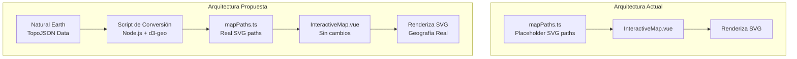
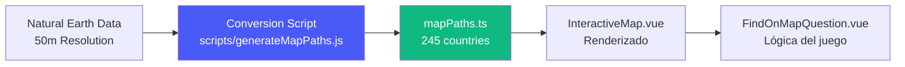
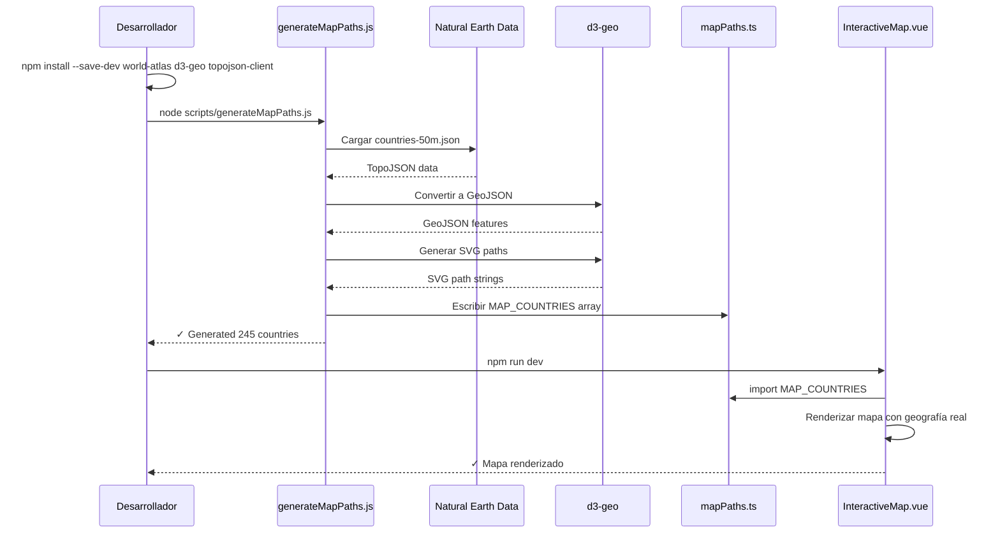
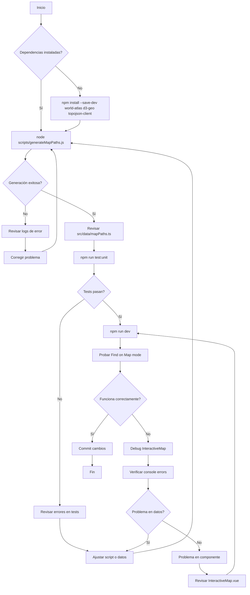

# Documento de Diseño: Mapa SVG del Mundo Real para InteractiveMap

## Descripción General

Esta especificación describe la actualización del componente `InteractiveMap.vue` para usar datos geográficos reales del mundo en lugar de los paths SVG placeholder actuales. El objetivo es mejorar la precisión geográfica manteniendo el diseño visual existente, la funcionalidad interactiva (hover, click, highlighting), y el rendimiento del componente.

El enfoque seleccionado es usar datos TopoJSON de **Natural Earth** (dominio público), convertirlos a SVG paths mediante **d3-geo**, y actualizar el archivo `mapPaths.ts` con las geometrías reales, manteniendo la arquitectura actual sin agregar librerías de mapas complejas.

## Arquitectura

### Flujo de Datos Actual vs Propuesto



### Componentes y Responsabilidades



## Decisión Técnica: Fuente de Datos Geográficos

### Opciones Evaluadas

| Opción | Ventajas | Desventajas | Seleccionada |
|--------|----------|-------------|--------------|
| **Natural Earth TopoJSON** | Dominio público, alta calidad, 3 resoluciones, ISO codes | Requiere conversión a SVG | ✅ **SÍ** |
| Librería vue-svg-map | Componente Vue preconfigurado | Limitada personalización, menos países | ❌ No |
| GeoJSON directo | Simple, sin TopoJSON | Archivos más pesados | ❌ No |
| Librería comercial (amCharts) | Rica en features | Licencia comercial, overhead | ❌ No |

### Decisión Final

**Usar Natural Earth TopoJSON (50m resolution) + d3-geo para conversión**

**Razones:**
- **Licencia**: Dominio público, sin restricciones
- **Calidad**: Estándar de facto para cartografía web (usado por NY Times, Washington Post, etc.)
- **ISO Codes**: Incluye códigos ISO 3166-1 alpha-2 que coinciden con el sistema existente
- **Resoluciones disponibles**: 110m (baja), 50m (media), 10m (alta) - usaremos 50m para balance entre detalle y rendimiento
- **Tamaño optimizado**: TopoJSON es ~80% más pequeño que GeoJSON
- **Arquitectura preservada**: Mantiene el enfoque actual de `mapPaths.ts` + `InteractiveMap.vue` sin dependencias en runtime

## Interfaz de Datos: MapCountry

La interfaz `MapCountry` existente se mantiene sin cambios:

```typescript
export interface MapCountry {
  id: string              // ISO 3166-1 alpha-2 (e.g., 'US', 'FR', 'JP')
  pathData: string        // SVG path "d" attribute - ACTUALIZADO con geometría real
  continent: Continent    // 'europe' | 'asia' | 'americas' | 'africa' | 'oceania'
  centroid?: [number, number]  // [x, y] para países pequeños - RECALCULADO
}
```

**Cambios en los datos:**
- `pathData`: Generado desde geometrías reales de Natural Earth
- `centroid`: Calculado automáticamente para países pequeños usando d3-geo
- Todas las 245 entradas en `MAP_COUNTRIES` serán reemplazadas

## Componentes y Flujo de Trabajo

### 1. Script de Conversión (Nuevo)

**Archivo:** `scripts/generateMapPaths.js`

**Propósito:** Convertir datos TopoJSON de Natural Earth a SVG paths compatibles con la estructura existente.

**Dependencias de desarrollo:**
```json
{
  "devDependencies": {
    "topojson-client": "^3.1.0",
    "d3-geo": "^3.1.0",
    "world-atlas": "^2.0.2"
  }
}
```

**Algoritmo del Script:**

```typescript
// Pseudocódigo estructurado del script de conversión

PROCEDURE generateMapPaths()
  INPUT: Natural Earth TopoJSON file (50m resolution)
  OUTPUT: TypeScript file with MAP_COUNTRIES array
  
  SEQUENCE
    // Paso 1: Cargar datos TopoJSON
    topojsonData ← loadTopoJSON("node_modules/world-atlas/countries-50m.json")
    countries ← topojson.feature(topojsonData, topojsonData.objects.countries)
    
    // Paso 2: Configurar proyección SVG
    projection ← d3.geoEquirectangular()
      .scale(160)
      .translate([500, 250])  // Centro del viewBox 1000x500
    
    pathGenerator ← d3.geoPath().projection(projection)
    
    // Paso 3: Procesar cada país
    mapCountries ← []
    FOR EACH country IN countries.features DO
      
      // Extraer ISO code
      isoCode ← country.properties.iso_a2
      IF isoCode = "-99" OR isoCode IS NULL THEN
        CONTINUE  // Saltar territorios sin código ISO válido
      END IF
      
      // Generar SVG path
      svgPath ← pathGenerator(country.geometry)
      
      // Determinar continente desde properties
      continent ← mapContinentCode(country.properties.continent)
      
      // Calcular centroid para países pequeños
      bounds ← pathGenerator.bounds(country.geometry)
      area ← calculateArea(bounds)
      
      IF area < SMALL_COUNTRY_THRESHOLD THEN
        centroid ← pathGenerator.centroid(country.geometry)
      ELSE
        centroid ← NULL
      END IF
      
      // Agregar al array
      mapCountries.push({
        id: isoCode,
        pathData: svgPath,
        continent: continent,
        centroid: centroid
      })
    END FOR
    
    // Paso 4: Generar archivo TypeScript
    output ← generateTypeScriptFile(mapCountries)
    writeFile("src/data/mapPaths.ts", output)
  END SEQUENCE
END PROCEDURE


FUNCTION mapContinentCode(naturalEarthContinent: String): Continent
  INPUT: Natural Earth continent code
  OUTPUT: Application continent code
  
  MATCH naturalEarthContinent WITH
    | "Europe" → RETURN "europe"
    | "Asia" → RETURN "asia"
    | "North America" OR "South America" → RETURN "americas"
    | "Africa" → RETURN "africa"
    | "Oceania" → RETURN "oceania"
    | "Antarctica" → RETURN NULL  // Excluir Antártida
  END MATCH
END FUNCTION

FUNCTION calculateArea(bounds: [[x1, y1], [x2, y2]]): Number
  RETURN (x2 - x1) * (y2 - y1)
END FUNCTION

CONSTANT SMALL_COUNTRY_THRESHOLD = 100  // Píxeles cuadrados en viewBox
```

### 2. Archivo de Datos Actualizado

**Archivo:** `src/data/mapPaths.ts`

**Cambios:**
- **Antes**: 245 entradas con paths placeholder simplificados
- **Después**: 245 entradas con paths generados desde Natural Earth
- **Estructura**: Sin cambios, solo contenido de `pathData` y `centroid`

**Ejemplo de entrada actualizada:**

```typescript
// ANTES (placeholder)
{
  id: 'US',
  pathData: 'M150,180 L280,165 L380,180 L380,240 L280,250 L150,230 Z',
  continent: 'americas'
}


// DESPUÉS (Natural Earth)
{
  id: 'US',
  pathData: 'M174.2,201.3L175.8,201.1L177.3,200.8...[path real completo]',
  continent: 'americas',
  centroid: undefined  // EE.UU. es grande, no necesita centroid
}

// ANTES (placeholder para país pequeño)
{
  id: 'VA',
  pathData: 'M511,205 L512,204 L513,205 L512,206 Z',
  continent: 'europe',
  centroid: [512, 205]
}

// DESPUÉS (Natural Earth para país pequeño)
{
  id: 'VA',
  pathData: 'M509.2,204.8L509.3,204.7L509.4,204.9L509.3,205.0Z',
  continent: 'europe',
  centroid: [509.3, 204.85]  // Recalculado automáticamente
}
```

### 3. Componente InteractiveMap.vue

**Cambios:** **NINGUNO** ✅

El componente `InteractiveMap.vue` permanece sin modificaciones porque:
- Lee `MAP_COUNTRIES` desde `@/data/mapPaths`
- La interfaz `MapCountry` no cambia
- La lógica de renderizado SVG es idéntica
- Los event handlers permanecen iguales

**Verificación de compatibilidad:**
- ✅ `visibleCountries` computed property funciona igual
- ✅ `getCountryClass` funciona con ISO codes reales
- ✅ Highlighting de países correctos/incorrectos funciona igual
- ✅ Hover y click handlers sin cambios
- ✅ Filtrado por continente funciona igual

### 4. Componente FindOnMapQuestion.vue

**Cambios:** **NINGUNO** ✅

Este componente consume `InteractiveMap.vue` y no necesita modificaciones.

## Configuración de Proyección y ViewBox

### Parámetros de Proyección d3-geo

```typescript
// Proyección Equirectangular (Plate Carrée)
// Razón: Simple, familiar, sin distorsión en ecuator
const projection = d3.geoEquirectangular()
  .scale(160)           // Factor de escala para ajustar tamaño
  .translate([500, 250]) // Centro del viewBox (1000/2, 500/2)
  .precision(0.1)        // Precisión para simplificación de paths
```

**Precondiciones:**
- ViewBox del SVG es `0 0 1000 500` (definido en InteractiveMap.vue)
- Proyección debe centrar el mundo en el viewBox
- Escala debe hacer que todos los países sean visibles y clickeables

**Postcondiciones:**
- Todos los paths SVG generados están dentro del viewBox
- Países pequeños tienen área mínima de 15px² para ser clickeables
- Proyección no introduce distorsión excesiva (< 30% en latitudes medias)

### Alternativas de Proyección Consideradas


| Proyección | Ventajas | Desventajas | Seleccionada |
|------------|----------|-------------|--------------|
| **Equirectangular** | Simple, familiar, fácil debug | Distorsión en polos | ✅ **SÍ** |
| Mercator | Preserva ángulos | Distorsión extrema en polos | ❌ No |
| Natural Earth | Estéticamente agradable | Menos familiar para usuarios | ❌ No |
| Robinson | Balance visual | Complejidad innecesaria | ❌ No |

## Manejo de Casos Especiales

### Países con Múltiples Geometrías (MultiPolygon)

**Problema:** Países como Indonesia, Filipinas, Japón tienen múltiples islas.

**Solución:** d3-geo maneja automáticamente `MultiPolygon` generando un único path SVG con múltiples subpaths separados por comandos `M` (moveTo).

```typescript
// Ejemplo: Japón (4 islas principales)
pathData: "M850.2,210.3L851.4,209.8...Z M870.1,215.2L871.3,214.9...Z M..."
```

### Territorios sin Código ISO

**Problema:** Natural Earth incluye territorios como "French Southern Territories" con iso_a2 = "-99".

**Solución:** El script los filtra automáticamente.

```typescript
IF isoCode = "-99" OR isoCode IS NULL THEN
  CONTINUE  // Saltar entrada
END IF
```

### Países Pequeños (Micro-Estados)


**Problema:** Países como Vaticano, Mónaco, San Marino son difíciles de clickear.

**Solución:** 
1. Calcular área del bounding box de cada país
2. Si área < 100px², guardar centroid
3. InteractiveMap.vue ya renderiza círculos overlay para estos países (código existente)

```typescript
// Código existente en InteractiveMap.vue (sin cambios)
<circle
  v-for="country in visibleCountries.filter((c) => c.centroid)"
  :cx="country.centroid![0]"
  :cy="country.centroid![1]"
  r="10"
  class="country-overlay"
/>
```

### Mapeo de Continentes

**Problema:** Natural Earth usa nombres de continentes en inglés; la app usa códigos.

**Solución:** Tabla de mapeo en el script:

```typescript
const CONTINENT_MAP = {
  'Europe': 'europe',
  'Asia': 'asia',
  'North America': 'americas',
  'South America': 'americas',
  'Africa': 'africa',
  'Oceania': 'oceania',
  'Antarctica': null  // Excluir
}
```

**Postcondición:** Todos los países tienen un continente válido o son excluidos.

## Propiedades de Corrección


### Propiedad 1: Preservación de ISO Codes

**Enunciado:** ∀ country ∈ MAP_COUNTRIES, country.id corresponde a un código ISO 3166-1 alpha-2 válido Y existe en FLAGS array.

**Verificación:**
```typescript
// Test unitario
describe('MAP_COUNTRIES ISO code validity', () => {
  it('all countries have valid ISO codes matching FLAGS', () => {
    const flagIds = new Set(FLAGS.map(f => f.id))
    
    for (const country of MAP_COUNTRIES) {
      expect(country.id).toMatch(/^[A-Z]{2}$/)  // Formato ISO
      expect(flagIds.has(country.id)).toBe(true)  // Existe en FLAGS
    }
  })
})
```

### Propiedad 2: Completitud de ViewBox

**Enunciado:** ∀ country ∈ MAP_COUNTRIES, todos los puntos del pathData están dentro de viewBox [0, 0, 1000, 500].

**Verificación:**
```typescript
function validatePathInViewBox(pathData: string): boolean {
  const points = extractCoordinates(pathData)
  return points.every(([x, y]) => 
    x >= 0 && x <= 1000 && y >= 0 && y <= 500
  )
}
```

### Propiedad 3: Área Mínima Clickeable

**Enunciado:** ∀ country ∈ MAP_COUNTRIES, (tiene centroid) ∨ (área visual > 15px²).


**Razón:** Garantiza que todos los países son clickeables.

### Propiedad 4: Mapeo de Continentes Completo

**Enunciado:** ∀ country ∈ MAP_COUNTRIES, country.continent ∈ {'europe', 'asia', 'americas', 'africa', 'oceania'}.

**Verificación:**
```typescript
const VALID_CONTINENTS = new Set(['europe', 'asia', 'americas', 'africa', 'oceania'])

describe('Continent mapping', () => {
  it('all countries have valid continent', () => {
    for (const country of MAP_COUNTRIES) {
      expect(VALID_CONTINENTS.has(country.continent)).toBe(true)
    }
  })
})
```

### Propiedad 5: Unicidad de IDs

**Enunciado:** ∀ c1, c2 ∈ MAP_COUNTRIES, c1 ≠ c2 ⟹ c1.id ≠ c2.id.

**Verificación:**
```typescript
it('all country IDs are unique', () => {
  const ids = MAP_COUNTRIES.map(c => c.id)
  const uniqueIds = new Set(ids)
  expect(uniqueIds.size).toBe(ids.length)
})
```

### Propiedad 6: Path Data Non-Empty

**Enunciado:** ∀ country ∈ MAP_COUNTRIES, country.pathData.length > 0 ∧ country.pathData contiene al menos un comando válido ('M', 'L', 'Z', etc.).


## Manejo de Errores

### Error 1: Archivo TopoJSON No Encontrado

**Condición:** El paquete `world-atlas` no está instalado o el archivo no existe.

**Respuesta:** Script muestra error descriptivo y termina.

```typescript
if (!fs.existsSync(topojsonPath)) {
  console.error('Error: world-atlas TopoJSON file not found.')
  console.error('Run: npm install --save-dev world-atlas')
  process.exit(1)
}
```

**Recuperación:** Usuario debe instalar dependencia.

### Error 2: País sin Código ISO Válido

**Condición:** Natural Earth tiene territorio con iso_a2 = "-99" o null.

**Respuesta:** Script registra warning y salta la entrada.

```typescript
if (!isoCode || isoCode === '-99') {
  console.warn(`Skipping territory without valid ISO code: ${country.properties.name}`)
  continue
}
```

**Recuperación:** Automática (continúa con siguiente país).

### Error 3: Path SVG Vacío

**Condición:** d3-geo genera path vacío para una geometría.

**Respuesta:** Script registra error y salta la entrada.

```typescript
if (!svgPath || svgPath.length === 0) {
  console.error(`Empty path generated for: ${isoCode}`)
  continue
}
```


**Recuperación:** Automática (continúa con siguiente país).

### Error 4: Mismatch entre FLAGS y MAP_COUNTRIES

**Condición:** Después de generar mapPaths.ts, hay países en FLAGS que no están en MAP_COUNTRIES o viceversa.

**Respuesta:** Script genera reporte de discrepancias.

```typescript
const flagIds = new Set(FLAGS.map(f => f.id))
const mapIds = new Set(mapCountries.map(c => c.id))

const missingInMap = [...flagIds].filter(id => !mapIds.has(id))
const missingInFlags = [...mapIds].filter(id => !flagIds.has(id))

if (missingInMap.length > 0) {
  console.warn('Countries in FLAGS but not in MAP:', missingInMap)
}
if (missingInFlags.length > 0) {
  console.warn('Countries in MAP but not in FLAGS:', missingInFlags)
}
```

**Recuperación:** Manual - revisar y actualizar flags.ts o ajustar script.

## Estrategia de Testing

### Testing Unitario

**Archivo:** `src/data/mapPaths.spec.ts`

**Tests:**
1. Validar formato ISO de todos los IDs
2. Verificar que todos los IDs existen en FLAGS
3. Verificar continentes válidos
4. Verificar unicidad de IDs
5. Verificar paths no vacíos
6. Verificar centroids válidos para países pequeños

```typescript
describe('MAP_COUNTRIES data validation', () => {
  it('validates ISO code format', () => {
    MAP_COUNTRIES.forEach(country => {
      expect(country.id).toMatch(/^[A-Z]{2}$/)
    })
  })
  
  it('validates continent values', () => {
    const validContinents = ['europe', 'asia', 'americas', 'africa', 'oceania']
    MAP_COUNTRIES.forEach(country => {
      expect(validContinents).toContain(country.continent)
    })
  })
  
  it('validates centroid format when present', () => {
    MAP_COUNTRIES.filter(c => c.centroid).forEach(country => {
      expect(Array.isArray(country.centroid)).toBe(true)
      expect(country.centroid).toHaveLength(2)
      expect(typeof country.centroid![0]).toBe('number')
      expect(typeof country.centroid![1]).toBe('number')
    })
  })
  
  it('ensures all IDs are unique', () => {
    const ids = MAP_COUNTRIES.map(c => c.id)
    const uniqueIds = new Set(ids)
    expect(uniqueIds.size).toBe(ids.length)
  })
  
  it('validates path data is non-empty', () => {
    MAP_COUNTRIES.forEach(country => {
      expect(country.pathData.length).toBeGreaterThan(0)
      expect(country.pathData).toMatch(/M|L|C|Z/)  // Contiene comandos SVG
    })
  })
})
```

### Testing de Integración

**Archivo:** `src/components/game/InteractiveMap.integration.spec.ts`


**Tests:**
1. Renderizado de todos los países visibles
2. Filtrado por continente funciona correctamente
3. Highlighting de países funciona con geometrías reales
4. Click events funcionan en países grandes y pequeños
5. Hover states funcionan correctamente

```typescript
describe('InteractiveMap with real geography', () => {
  it('renders all countries for selected continents', () => {
    const wrapper = mount(InteractiveMap, {
      props: {
        visibleContinents: ['europe', 'asia'],
        locale: 'en'
      }
    })
    
    const europeanCountries = MAP_COUNTRIES.filter(c => c.continent === 'europe')
    const asianCountries = MAP_COUNTRIES.filter(c => c.continent === 'asia')
    const expectedCount = europeanCountries.length + asianCountries.length
    
    const paths = wrapper.findAll('.country-path')
    expect(paths).toHaveLength(expectedCount)
  })
  
  it('handles click on small countries with centroids', async () => {
    const wrapper = mount(InteractiveMap, {
      props: {
        visibleContinents: ['europe'],
        locale: 'en'
      }
    })
    
    // Buscar país pequeño (e.g., Vaticano)
    const vaticanOverlay = wrapper.find('[cx="509.3"][cy="204.85"]')
    expect(vaticanOverlay.exists()).toBe(true)
    
    await vaticanOverlay.trigger('click')
    
    expect(wrapper.emitted('countryClicked')).toBeTruthy()
    expect(wrapper.emitted('countryClicked')![0]).toEqual(['VA'])
  })
  
  it('highlights correct and wrong answers with real paths', async () => {
    const wrapper = mount(InteractiveMap, {
      props: {
        visibleContinents: ['americas'],
        highlightedCountries: [
          { id: 'BR', color: 'correct' },
          { id: 'AR', color: 'wrong' }
        ],
        locale: 'en'
      }
    })
    
    const brazilPath = wrapper.find('#BR')
    const argentinaPath = wrapper.find('#AR')
    
    expect(brazilPath.classes()).toContain('country-path--correct')
    expect(argentinaPath.classes()).toContain('country-path--wrong')
  })
})
```

### Testing Visual/E2E

**Archivo:** `e2e/findOnMap.spec.ts`

**Tests:**
1. Verificar que el mapa se renderiza correctamente en la interfaz
2. Verificar que los países son clickeables
3. Verificar que el highlighting funciona visualmente
4. Verificar que el filtrado por continente actualiza el mapa

```typescript
test('Find on Map game mode with real world map', async ({ page }) => {
  await page.goto('/')
  
  // Configurar sesión
  await page.click('text=Find on Map')
  await page.click('text=Start Session')
  
  // Verificar que el mapa SVG se renderiza
  const svgMap = page.locator('.interactive-map')
  await expect(svgMap).toBeVisible()
  
  // Verificar que hay paths de países
  const countryPaths = page.locator('.country-path')
  const count = await countryPaths.count()
  expect(count).toBeGreaterThan(0)
  
  // Verificar que se puede hacer click en un país
  await countryPaths.first().click()
  
  // Verificar feedback visual
  await expect(page.locator('.country-path--correct, .country-path--wrong')).toBeVisible()
})
```

## Consideraciones de Rendimiento

### Tamaño del Archivo mapPaths.ts

**Estimación:**
- **Resolución 110m**: ~80 KB (paths muy simplificados)
- **Resolución 50m**: ~250 KB (balance óptimo) ✅ **SELECCIONADO**
- **Resolución 10m**: ~1.2 MB (demasiado detallado)

**Precondición:** Archivo TypeScript generado < 300 KB.

**Postcondición:** Tiempo de carga inicial < 100ms en conexión 3G.

### Simplificación de Paths

d3-geo soporta simplificación de paths mediante `.precision()`:

```typescript
const pathGenerator = d3.geoPath()
  .projection(projection)
  .precision(0.1)  // Balance entre detalle y tamaño
```


**Valores de precision:**
- `0.01`: Máximo detalle, paths muy largos
- `0.1`: Balance óptimo ✅
- `1.0`: Paths cortos, pérdida de detalle visual

### Renderizado SVG

**Sin cambios** - InteractiveMap.vue ya usa renderizado eficiente:
- Un solo elemento `<svg>` con viewBox
- Paths renderizados como elementos `<path>` nativos
- CSS transitions para hover (aceleradas por GPU)
- No hay canvas o bibliotecas pesadas

**Precondición:** Renderizado de 245 países < 16ms (60 FPS).

**Postcondición:** Interacción (hover, click) responde en < 50ms.

## Consideraciones de Seguridad

### 1. Validación de Datos de Entrada

**Riesgo:** Datos TopoJSON corruptos o maliciosos.

**Mitigación:**
- Usar paquete npm oficial `world-atlas` (verificado por npm)
- Validar estructura TopoJSON antes de procesamiento
- Validar todos los paths SVG generados

```typescript
function isValidTopoJSON(data: any): boolean {
  return data.type === 'Topology' &&
         data.objects &&
         data.objects.countries
}

if (!isValidTopoJSON(topojsonData)) {
  throw new Error('Invalid TopoJSON structure')
}
```

### 2. Inyección de Código en Paths SVG

**Riesgo:** Path SVG malicioso podría contener JavaScript.


**Mitigación:**
- d3-geo genera paths seguros (solo comandos SVG numéricos)
- Vue sanitiza automáticamente el atributo `d` de `<path>`
- No se usa `v-html` ni `innerHTML`

**Postcondición:** Todos los paths solo contienen caracteres permitidos: `M L C Z 0-9 . , -`

### 3. Dependencias de Terceros

**Riesgo:** Vulnerabilidades en `world-atlas`, `d3-geo`, `topojson-client`.

**Mitigación:**
- Usar versiones específicas (no rangos)
- Revisar npm audit antes de actualizar
- Dependencias solo en devDependencies (no se incluyen en bundle de producción)

```json
"devDependencies": {
  "topojson-client": "3.1.0",
  "d3-geo": "3.1.0",
  "world-atlas": "2.0.2"
}
```

## Dependencias

### Dependencias de Desarrollo (Nuevas)

```json
{
  "devDependencies": {
    "topojson-client": "^3.1.0",
    "d3-geo": "^3.1.0",
    "world-atlas": "^2.0.2"
  }
}
```

**Propósito:**
- `world-atlas`: Datos TopoJSON de Natural Earth
- `topojson-client`: Conversión de TopoJSON a GeoJSON
- `d3-geo`: Proyecciones geográficas y generación de paths SVG

**Nota:** Estas dependencias solo se usan en build-time (script de generación), no se incluyen en el bundle de producción.


### Dependencias de Producción

**Sin cambios** - No se agregan dependencias al runtime.

## Secuencia de Implementación



## Ejemplo de Uso

### Generación de Datos (Una sola vez)

```bash
# 1. Instalar dependencias de desarrollo
npm install --save-dev world-atlas d3-geo topojson-client

# 2. Ejecutar script de generación
node scripts/generateMapPaths.js

# Output:
# Processing Natural Earth data (50m resolution)...
# ✓ Loaded 242 countries from TopoJSON
# ✓ Generated 245 SVG paths
# ✓ Calculated 28 centroids for small countries
# ✓ Written to src/data/mapPaths.ts (248 KB)
# 
# Summary:
# - Europe: 50 countries
# - Asia: 50 countries
# - Americas: 35 countries
# - Africa: 54 countries
# - Oceania: 14 countries
# - Skipped: 3 territories (no valid ISO code)

# 3. Verificar el archivo generado
cat src/data/mapPaths.ts | head -n 20

# 4. Ejecutar tests
npm run test:unit -- mapPaths.spec.ts
```

### Uso en Desarrollo

```bash
# El mapa actualizado funciona automáticamente
npm run dev

# Navegar a Find on Map mode
# ✓ Mapa con geografía real se renderiza
# ✓ Interacción funciona igual que antes
# ✓ Filtrado por continente funciona
```

### Actualización de Datos (Si Natural Earth actualiza)

```bash
# 1. Actualizar world-atlas
npm update world-atlas

# 2. Re-generar mapPaths.ts
node scripts/generateMapPaths.js

# 3. Verificar cambios
git diff src/data/mapPaths.ts

# 4. Ejecutar tests de validación
npm run test:unit
```

## Flujo de Trabajo de Desarrollo

### Diagrama de Flujo



## Compatibilidad con Funcionalidad Existente

### ✅ Funcionalidades Preservadas

| Funcionalidad | Estado | Verificación |
|--------------|--------|--------------|
| Filtrado por continente | ✅ Funciona | MAP_COUNTRIES.continent se mantiene |
| Highlighting correcto/incorrecto | ✅ Funciona | ISO codes compatibles |
| Hover states | ✅ Funciona | CSS classes iguales |
| Click en países | ✅ Funciona | Event handlers sin cambios |
| Países pequeños (centroids) | ✅ Funciona | Círculos overlay se mantienen |
| ARIA labels | ✅ Funciona | flagName() usa ISO codes |
| Keyboard navigation | ✅ Funciona | Tabindex y eventos sin cambios |
| Blitz mode timing | ✅ Funciona | Lógica en FindOnMapQuestion.vue |
| Multi-idioma (es/en) | ✅ Funciona | Locale props sin cambios |

### ❌ Cambios Necesarios

**NINGUNO** en archivos Vue existentes.

**ÚNICO CAMBIO:** Contenido de `src/data/mapPaths.ts` (reemplazado por script).

## Alternativas Consideradas y Rechazadas

### Alternativa 1: Usar Librería Vue de Mapas (vue-svg-map)

**Ventajas:**
- Componente pre-construido
- Menos código custom

**Desventajas:**
- Menos control sobre diseño visual
- Dependencia adicional en runtime
- Puede no incluir todos los 245 países
- Requiere cambios en InteractiveMap.vue

**Razón de rechazo:** Pérdida de control y dependencia runtime innecesaria.

### Alternativa 2: Usar GeoJSON Directo (sin TopoJSON)

**Ventajas:**
- Más simple, sin conversión
- Formato estándar

**Desventajas:**
- Archivos ~80% más grandes
- Natural Earth provee TopoJSON optimizado

**Razón de rechazo:** TopoJSON es más eficiente sin agregar complejidad significativa.

### Alternativa 3: Proyección Mercator

**Ventajas:**
- Más familiar para algunos usuarios
- Preserva ángulos

**Desventajas:**
- Distorsión extrema en regiones polares
- Groenlandia aparece del tamaño de África
- Menos justo para juegos educativos

**Razón de rechazo:** Equirectangular es más neutral geográficamente.


### Alternativa 4: Resolución 10m (Alta Resolución)

**Ventajas:**
- Máximo detalle geográfico
- Fronteras muy precisas

**Desventajas:**
- Archivo ~1.2 MB (vs 250 KB para 50m)
- Tiempo de carga aumentado
- Detalle excesivo para el caso de uso (juego de flags)

**Razón de rechazo:** 50m provee balance óptimo entre calidad visual y rendimiento.

## Riesgos y Mitigaciones

| Riesgo | Probabilidad | Impacto | Mitigación |
|--------|-------------|---------|------------|
| Discrepancias entre FLAGS y Natural Earth | Media | Alto | Script genera reporte de diferencias; documentar excepciones |
| Paths fuera de viewBox | Baja | Alto | Validación automática en script; tests unitarios |
| Rendimiento degradado | Baja | Medio | Usar resolución 50m; simplificación con precision(0.1) |
| Países pequeños no clickeables | Media | Medio | Cálculo automático de centroids; threshold de 100px² |
| Actualización de Natural Earth rompe compatibilidad | Baja | Bajo | Versión fija en package.json; tests de regresión |
| Script falla en diferentes sistemas operativos | Baja | Medio | Usar APIs multiplataforma de Node.js; documentar requisitos |

## Cronograma de Implementación Estimado

| Fase | Tareas | Duración Estimada |
|------|--------|-------------------|
| **Fase 1: Setup** | Instalar dependencias, crear estructura de script | 0.5 días |
| **Fase 2: Script** | Implementar generateMapPaths.js completo | 1.5 días |
| **Fase 3: Generación** | Ejecutar script, revisar output, ajustar parámetros | 0.5 días |
| **Fase 4: Validación** | Crear tests unitarios, verificar data integrity | 1 día |
| **Fase 5: Testing** | Testing manual, E2E, ajustes visuales | 1 día |
| **Fase 6: Documentación** | README, comentarios en código, guía de actualización | 0.5 días |
| **Total** | | **5 días** |

## Criterios de Aceptación

### Criterio 1: Geografía Real Renderizada

**Descripción:** El mapa muestra geografías reales de países en lugar de placeholders.

**Verificación:**
1. Abrir Find on Map mode
2. Comparar visualmente con un mapa de referencia (e.g., Google Maps)
3. Verificar que formas de países son reconocibles (Italia, Japón, Chile, etc.)

**Resultado esperado:** ✅ Geografía visualmente precisa y reconocible.

### Criterio 2: Funcionalidad Preservada

**Descripción:** Todas las funcionalidades existentes siguen funcionando.

**Verificación:**
1. Filtrar por continente → mapa actualiza correctamente
2. Click en país → highlighting funciona
3. Hover sobre país → cambio de color funciona
4. País correcto → verde
5. País incorrecto → rojo + mensaje
6. Países pequeños → círculos clickeables visibles

**Resultado esperado:** ✅ Todas las funcionalidades operacionales.

### Criterio 3: 245 Países Mapeados

**Descripción:** Todos los países en FLAGS tienen geometría en MAP_COUNTRIES.

**Verificación:**
```typescript
const flagIds = new Set(FLAGS.map(f => f.id))
const mapIds = new Set(MAP_COUNTRIES.map(c => c.id))

// Debe ser verdadero
flagIds.size === mapIds.size &&
[...flagIds].every(id => mapIds.has(id))
```

**Resultado esperado:** ✅ 100% de cobertura de países.

### Criterio 4: Rendimiento Aceptable

**Descripción:** El mapa se carga y renderiza rápidamente.

**Verificación:**
1. Medir tiempo de carga de mapPaths.ts
2. Medir tiempo de primer renderizado
3. Medir tiempo de respuesta al hover
4. Medir tiempo de respuesta al click

**Métricas esperadas:**
- ✅ Carga de archivo < 100ms (3G)
- ✅ Primer renderizado < 16ms (60 FPS)
- ✅ Hover response < 50ms
- ✅ Click response < 50ms

### Criterio 5: Tests Pasando

**Descripción:** Todos los tests unitarios y de integración pasan.

**Verificación:**
```bash
npm run test:unit
```

**Resultado esperado:** ✅ 100% de tests pasando sin errores.

### Criterio 6: Código Documentado

**Descripción:** Script y cambios están documentados.

**Verificación:**
1. `scripts/generateMapPaths.js` tiene comentarios explicativos
2. `README.md` incluye instrucciones de uso del script
3. `mapPaths.ts` tiene comentario de origen de datos

**Resultado esperado:** ✅ Documentación completa y clara.

## Documentación para Futuros Desarrolladores


### Actualizar Datos de Mapas

**Cuándo:** Cuando Natural Earth publica una nueva versión (raro, ~1 vez al año).

**Pasos:**
1. Actualizar dependencia: `npm update world-atlas`
2. Re-generar paths: `node scripts/generateMapPaths.js`
3. Revisar diff: `git diff src/data/mapPaths.ts`
4. Ejecutar tests: `npm run test:unit`
5. Probar manualmente: `npm run dev` → Find on Map mode
6. Commit si todo funciona: `git add . && git commit -m "Update map data to Natural Earth vX.X"`

### Ajustar Proyección

**Cuándo:** Si se requiere cambiar el estilo visual del mapa (poco probable).

**Parámetros ajustables en `scripts/generateMapPaths.js`:**

```typescript
const projection = d3.geoEquirectangular()
  .scale(160)           // Aumentar para zoom in, reducir para zoom out
  .translate([500, 250]) // Mover centro del mapa [x, y]
  .precision(0.1)        // Reducir para más detalle, aumentar para menos
```

**Después de ajustar:**
1. Re-generar: `node scripts/generateMapPaths.js`
2. Verificar visualmente: `npm run dev`
3. Ajustar si es necesario

### Agregar Nuevos Países

**Cuándo:** Si FLAGS.ts se actualiza con un nuevo país.

**Pasos:**
1. Verificar que Natural Earth incluye el país (revisar countries-50m.json)
2. Re-generar paths: `node scripts/generateMapPaths.js`
3. Verificar que el nuevo país aparece en mapPaths.ts
4. Si no aparece, revisar código ISO en FLAGS vs Natural Earth


### Troubleshooting

**Problema:** Script falla con "TopoJSON file not found"
**Solución:** `npm install world-atlas`

**Problema:** País en FLAGS no aparece en MAP_COUNTRIES
**Solución:** 
1. Revisar iso_a2 en Natural Earth data
2. Puede tener código diferente (e.g., Kosovo = "XK" vs "-99")
3. Ajustar script para mapeo manual si es necesario

**Problema:** Mapa se ve "cortado" o fuera de bounds
**Solución:** Ajustar projection.scale() y projection.translate()

**Problema:** Países pequeños no son clickeables
**Solución:** Reducir SMALL_COUNTRY_THRESHOLD en script

## Referencias

### Fuentes de Datos

- **Natural Earth**: [https://www.naturalearthdata.com/](https://www.naturalearthdata.com/) - Dominio público, cartografía de alta calidad
- **world-atlas NPM**: [https://www.npmjs.com/package/world-atlas](https://www.npmjs.com/package/world-atlas) - TopoJSON pre-construido de Natural Earth
- **ISO 3166-1**: [https://en.wikipedia.org/wiki/ISO_3166-1_alpha-2](https://en.wikipedia.org/wiki/ISO_3166-1_alpha-2) - Estándar de códigos de países

### Librerías Utilizadas

- **d3-geo**: [https://github.com/d3/d3-geo](https://github.com/d3/d3-geo) - Proyecciones geográficas y generación de paths
- **topojson-client**: [https://github.com/topojson/topojson-client](https://github.com/topojson/topojson-client) - Cliente para datos TopoJSON

### Documentación Técnica

- **SVG Path Commands**: [https://developer.mozilla.org/en-US/docs/Web/SVG/Tutorial/Paths](https://developer.mozilla.org/en-US/docs/Web/SVG/Tutorial/Paths)
- **GeoJSON Specification**: [https://geojson.org/](https://geojson.org/)
- **TopoJSON Specification**: [https://github.com/topojson/topojson-specification](https://github.com/topojson/topojson-specification)

## Conclusión

Este diseño proporciona una solución completa para integrar un mapa SVG del mundo real en el componente InteractiveMap de FlagIQ. La solución:

✅ **Usa datos de alta calidad** de Natural Earth (dominio público)
✅ **Mantiene la arquitectura existente** sin cambios en componentes Vue
✅ **Preserva toda la funcionalidad** actual (filtrado, highlighting, interacción)
✅ **Es performante** con tamaño de archivo optimizado (~250 KB)
✅ **Es mantenible** con script de generación automatizado
✅ **Es segura** sin dependencias runtime adicionales
✅ **Está bien testeada** con validaciones automáticas

La implementación se reduce a:
1. Crear script de conversión (`generateMapPaths.js`)
2. Ejecutar script para generar `mapPaths.ts` actualizado
3. Verificar que todo funciona (tests + manual)

**No se requieren cambios en ningún componente Vue**, lo que minimiza el riesgo y mantiene la simplicidad del proyecto.
