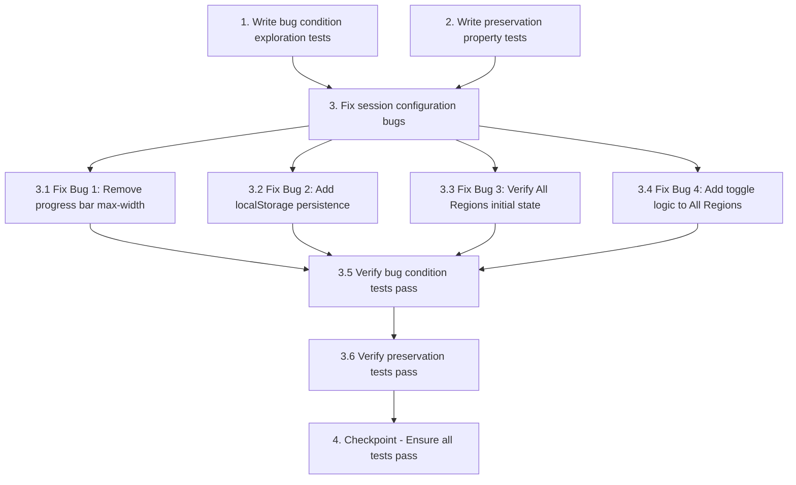

# Implementation Plan

## Overview

This implementation plan addresses four user experience bugs in the FlagIQ session configuration system:

1. **Progress bar width restriction**: Remove hardcoded `max-width: 640px` from GameProgressBar
2. **Configuration persistence**: Add localStorage integration to SessionStore for config persistence
3. **"All Regions" initial state**: Fix active state display on app initialization
4. **"All Regions" toggle behavior**: Add bidirectional toggle logic (select all ↔ deselect to one)

The implementation follows the bugfix workflow: write exploration tests first (expect failures), write preservation tests (expect passes), implement fixes, then verify all tests pass.

## Tasks

- [x] 1. Write bug condition exploration tests
  - **Property 1: Bug Condition** - Session Config Fixes Exploration
  - **CRITICAL**: These tests MUST FAIL on unfixed code - failure confirms the bugs exist
  - **DO NOT attempt to fix the tests or the code when they fail**
  - **NOTE**: These tests encode the expected behavior - they will validate the fixes when they pass after implementation
  - **GOAL**: Surface counterexamples that demonstrate each of the four bugs exists
  - **Scoped PBT Approach**: For each bug, scope the property to the concrete failing case(s) to ensure reproducibility
  
  - **Bug 1 - Progress Bar Width**: Test that GameProgressBar on screens wider than 640px uses full parent width (from Bug Condition C1 in design)
  - **Bug 2 - Persistence**: Test that custom session config persists across page reloads (from Bug Condition C2 in design)
  - **Bug 3 - Initial Active State**: Test that "All Regions" button shows active state when all continents are selected on initialization (from Bug Condition C3 in design)
  - **Bug 4 - Toggle Behavior**: Test that "All Regions" button deselects all continents (to 1) when clicked while all are already selected (from Bug Condition C4 in design)
  
  - The test assertions should match the Expected Behavior Properties from design (P1: full-width, P2: restored config, P3: active button, P4: toggled selection)
  - Run tests on UNFIXED code
  - **EXPECTED OUTCOME**: Tests FAIL (this is correct - it proves the bugs exist)
  - Document counterexamples found to understand root causes:
    - Progress bar limited to 640px despite wider parent
    - Config resets to DEFAULT_SESSION_CONFIG after reload
    - "All Regions" button missing `chip--all-active` class on init
    - `selectAll()` doesn't deselect when all continents already selected
  - Mark task complete when tests are written, run, and failures are documented
  - _Requirements: 2.1, 2.2, 2.3, 2.4_

- [x] 2. Write preservation property tests (BEFORE implementing fix)
  - **Property 2: Preservation** - Non-Buggy Interactions Preserved
  - **IMPORTANT**: Follow observation-first methodology
  - Observe behavior on UNFIXED code for non-buggy inputs
  - Write property-based tests capturing observed behavior patterns from Preservation Requirements
  - Property-based testing generates many test cases for stronger guarantees
  
  - **Test Areas**:
    - GameProgressBar props display (current, total, streak) for various values
    - Individual continent toggle buttons continue working independently
    - SessionSetupPanel local refs remain reactive
    - "All Regions" button selects all when not all are selected (partial → all)
    - Session validation logic continues enforcing constraints
    - Session start workflow (updateConfig → startSession → router.push) remains functional
    - Progress bar styling, animations, and transitions remain unchanged
  
  - Run tests on UNFIXED code
  - **EXPECTED OUTCOME**: Tests PASS (this confirms baseline behavior to preserve)
  - Mark task complete when tests are written, run, and passing on unfixed code
  - _Requirements: 3.1, 3.2, 3.3, 3.4, 3.5, 3.6, 3.7_

- [x] 3. Fix session configuration bugs

  - [x] 3.1 Fix Bug 1: Remove progress bar max-width constraint
    - Open `src/components/game/GameProgressBar.vue`
    - Locate the `<style scoped>` section and `.progress-bar-wrapper` CSS rule
    - Remove the line `max-width: 640px;` from the rule
    - This allows the progress bar to use full available parent width
    - _Bug_Condition: isBugCondition(input) where input.type = 'render' AND input.component = 'GameProgressBar' AND input.screenWidth > 640_
    - _Expected_Behavior: P1 - Progress bar occupies 100% of parent container width_
    - _Preservation: Requirements 3.1, 3.7 - progress props display and styling remain unchanged_
    - _Requirements: 2.1, 3.1, 3.7_

  - [x] 3.2 Fix Bug 2: Add localStorage persistence to SessionStore
    - Open `src/stores/session.ts`
    - Add localStorage key constant: `const SESSION_CONFIG_KEY = 'flagiq:sessionConfig'` at module level
    - Add `saveConfigToStorage(config: SessionConfig)` function that saves config to localStorage with try-catch error handling
    - Add `loadConfigFromStorage(): SessionConfig | null` function that loads and validates config from localStorage with try-catch error handling
    - Update config initialization: `const config = ref<SessionConfig>(loadConfigFromStorage() ?? { ...DEFAULT_SESSION_CONFIG })`
    - Update `updateConfig` function to call `saveConfigToStorage(config.value)` after successful validation
    - _Bug_Condition: isBugCondition(input) where input.type = 'pageLoad' AND input.hasStoredConfig = true_
    - _Expected_Behavior: P2 - Configuration persists across page reloads_
    - _Preservation: Requirements 3.2, 3.6 - session validation and start workflow remain unchanged_
    - _Requirements: 2.2, 3.2, 3.6_

  - [x] 3.3 Fix Bug 3: Verify "All Regions" initial active state
    - Open `src/components/session/ContinentFilter.vue`
    - Verify the template has: `:class="{ 'chip--all-active': modelValue.length === ALL_CONTINENTS.length }"`
    - If the existing binding doesn't work on initial render, add computed property:
      ```typescript
      const allSelected = computed(() => props.modelValue.length === ALL_CONTINENTS.length)
      ```
    - Update template binding to: `:class="{ 'chip--all-active': allSelected }"`
    - This ensures reactive active state on initialization
    - _Bug_Condition: isBugCondition(input) where input.type = 'appInit' AND input.defaultConfigHasAllContinents = true_
    - _Expected_Behavior: P3 - "All Regions" button shows active state on initialization_
    - _Preservation: Requirement 3.5 - active state for partial selection remains unchanged_
    - _Requirements: 2.3, 3.5_

  - [x] 3.4 Fix Bug 4: Add toggle logic to "All Regions" button
    - Open `src/components/session/ContinentFilter.vue`
    - Locate the `selectAll()` function in `<script setup>`
    - Replace the function with toggle logic:
      ```typescript
      function selectAll() {
        if (props.modelValue.length === ALL_CONTINENTS.length) {
          // All selected → deselect to minimum (1 continent)
          emit('update:modelValue', [ALL_CONTINENTS[0]])
        } else {
          // Not all selected → select all
          emit('update:modelValue', [...ALL_CONTINENTS])
        }
      }
      ```
    - _Bug_Condition: isBugCondition(input) where input.type = 'buttonClick' AND input.button = 'AllRegions' AND input.allContinentsSelected = true_
    - _Expected_Behavior: P4 - "All Regions" button toggles selection (deselects to 1 continent when all selected)_
    - _Preservation: Requirements 3.3, 3.4 - individual continent toggles and partial → all selection remain unchanged_
    - _Requirements: 2.4, 3.3, 3.4_

  - [x] 3.5 Verify bug condition exploration tests now pass
    - **Property 1: Expected Behavior** - Session Config Fixes Applied
    - **IMPORTANT**: Re-run the SAME tests from task 1 - do NOT write new tests
    - The tests from task 1 encode the expected behavior
    - When these tests pass, it confirms the expected behaviors are satisfied:
      - P1: Progress bar uses full width on wide screens
      - P2: Configuration persists across page reloads
      - P3: "All Regions" button shows active state on init
      - P4: "All Regions" button toggles to 1 continent when all selected
    - Run bug condition exploration tests from step 1
    - **EXPECTED OUTCOME**: Tests PASS (confirms bugs are fixed)
    - _Requirements: 2.1, 2.2, 2.3, 2.4_

  - [x] 3.6 Verify preservation tests still pass
    - **Property 2: Preservation** - Non-Buggy Interactions Preserved
    - **IMPORTANT**: Re-run the SAME tests from task 2 - do NOT write new tests
    - Run preservation property tests from step 2
    - **EXPECTED OUTCOME**: Tests PASS (confirms no regressions)
    - Confirm all preservation areas still work:
      - GameProgressBar props display correctly
      - Individual continent toggles work
      - SessionSetupPanel refs are reactive
      - Partial → all selection works
      - Session validation enforces constraints
      - Session start workflow functions correctly
      - Progress bar styling and animations preserved

- [x] 4. Checkpoint - Ensure all tests pass
  - Ensure all tests pass, ask the user if questions arise

## Task Dependency Graph



```json
{
  "waves": [
    {
      "name": "Wave 1: Test Preparation",
      "tasks": ["1", "2"]
    },
    {
      "name": "Wave 2: Bug Fixes",
      "tasks": ["3.1", "3.2", "3.3", "3.4"]
    },
    {
      "name": "Wave 3: Verification",
      "tasks": ["3.5", "3.6"]
    },
    {
      "name": "Wave 4: Final Checkpoint",
      "tasks": ["4"]
    }
  ]
}
```

## Notes

- **Exploration tests (Task 1)** are expected to FAIL on unfixed code - this confirms the bugs exist
- **Preservation tests (Task 2)** must PASS on unfixed code - this establishes the baseline behavior to preserve
- All four bugs are independent and can be fixed in parallel (Tasks 3.1-3.4)
- Tasks 3.5 and 3.6 rerun the same tests from Tasks 1 and 2 - do NOT write new tests
- The localStorage persistence fix (3.2) includes error handling for invalid stored data
- The "All Regions" toggle (3.4) deselects to 1 continent (not 0) to maintain validation constraint
